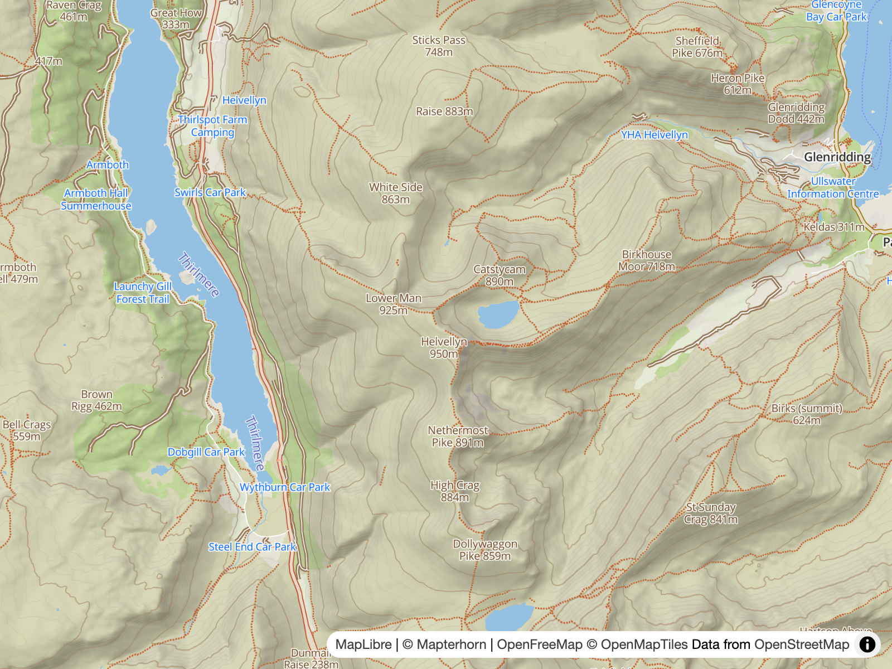

# Outdoors

> A Free and Open-Source map style for the great outdoors.

> [!WARNING]
> This project is currently a **Proof of Concept**. It's a work in progress, so please treat it as such.

[](https://www.ogis.org/outdoors/#12/54.52653/-3.01724/)

[View Demo →](https://www.ogis.org/outdoors/)

---

Outdoors combines a number of Free and Open-Source data sources and software projects, without which this project would not be possible.

## Key Sources

- [OpenFreeMap](https://openfreemap.org/) — Base vector tiles ([OpenMapTiles schema](https://github.com/openmaptiles/openmaptiles)) for the entire planet.
- [Mapterhorn](https://mapterhorn.com/) — Powers 3D terrain, hillshading & contour lines.
- [Open GIS](https://tile.ogis.app/)
  - [Tile Server](docs/7.server.md) - Outdoor-specific POIs, low-level paths & contours.
  - [Style Assets](https://www.ogis.org/basemap/) - Basemap style glyphs & sprites.

## Key Dependencies

- [© OpenStreetMap Contributors](https://www.openstreetmap.org/copyright)
- [OpenMapTiles](https://github.com/openmaptiles/openmaptiles)
  - [Schema](https://openmaptiles.org/schema)
  - [OSM Style](https://github.com/openmaptiles/openmaptiles/tree/master/style)
- [MapLibre Style Spec](https://maplibre.org/maplibre-style-spec/)
- [Planetiler](https://github.com/onthegomap/planetiler)
- [maplibre-contour](https://github.com/onthegomap/maplibre-contour) ([contour-mvt-server](https://github.com/acalcutt/contour-mvt-server))

## Build

```bash
npm install                           # Install dependencies
npm run build                         # Build `style.json` from `scripts/build.mjs` (also validates)
```

## Development

The dev server uses the same compare app as the demo, with HMR support.

```bash
npm install                           # Install dependencies
npm run dev                           # Start Vite dev server + auto-build watcher
```

### Other Scripts

```bash
# Validate
npm run validate:style                # Validate `style.json` (MapLibre style spec)

# Sprites
npm run sprite:build                  # Build the outdoors sprite sheet from `icons/` into `dev/public/`

# POIs
npm run pois:schema                   # Regenerate `pois/pois-schema.yml` from `scripts/poi-config.mjs`
npm run check:pois                    # Sprite / kind-coverage / schema-sync checks

# Demo
npm run demo:build                    # Build demo (`demo/`)
npm run demo:preview                  # Preview demo

# Screenshots
npx playwright install chromium
npm run screenshots                   # Regenerate every shot in shots.json
npm run screenshots -- --name <id>    # Regenerate a single shot by id
```

---

[Read the Docs →](docs/README.md)
