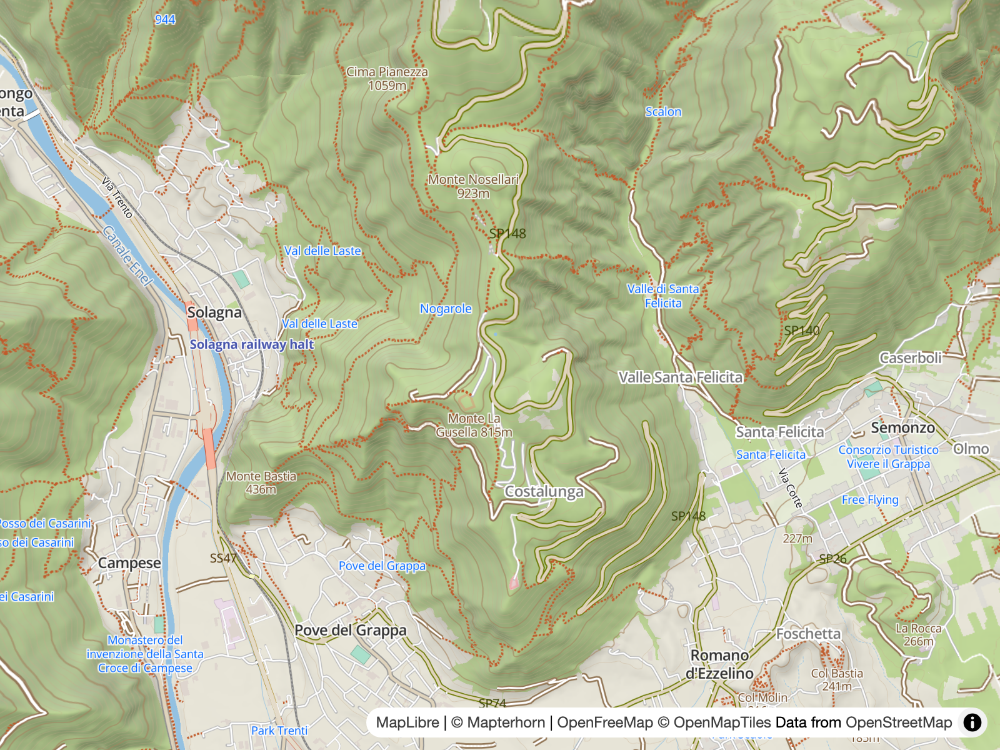

# Style Structure

> Outdoors is a modified version of the [OpenFreeMap fork](https://github.com/hyperknot/openfreemap-styles/tree/main/styles/liberty) of the [OSM Liberty](https://github.com/maputnik/osm-liberty) style.

## The Liberty Foundation

Out of the box Liberty provides an excellent world map featuring:

- Vector [OpenStreetMap](https://www.openstreetmap.org/) data ([OpenMapTiles](http://openmaptiles.org/) schema).
- [Natural Earth Tiles](https://klokantech.github.io/naturalearthtiles/) for relief shading.
- [Maki](https://www.mapbox.com/maki-icons/) as the icon set
- [Orange Mug](https://github.com/orangemug/font-glyphs) as the font glyphs

This makes for an excellent starting point. The [OpenFreeMap project](https://openfreemap.org/) provides vector tiles of the entire planet, for free. Liberty + OFM is an enormous leg up and is the basis for this style, so thank you, OpenFreeMap, and thank you, Open-Source!

Many parts of Liberty are kept — labels, water, boundaries and rail, for example — while the visual layers — landcover, landuse, roads, buildings and POIs — are replaced with outdoor-first versions.

> [!IMPORTANT]
> The style is generated programmatically; see [Build Script](1.build.md). Each feature has configuration variables; flip a toggle or tweak a constant and rebuild (this is automatic in the dev app).

## Groundwork

Some initial housekeeping:

- **Urban removal** — one-way street arrows and US interstate and road shields are removed (`applyUrbanRemoval()`).
- **Terrain palette** — the base fills — background, water, grass, wood, park, sand, ice, residential, buildings — are recoloured in muted, low-contrast colours with reduced opacities (`applyTerrainPalette()`).

## Terrain & Elevation

- **DEM source** — a single raster-dem source (Mapterhorn, Terrarium encoding) is added (`applyDemSource()`); it feeds both the hillshade layer and the 3D terrain, and is the same endpoint as the [contour service](7.server.md#contour-service).
- **Hillshade** — a 2D relief layer from the DEM (`applyDemHillshade()`); exaggeration ramps from zero at low zoom (`HILLSHADE_EXAGGERATION`).
- **3D terrain** — the style's `terrain` property is set to the DEM source for pitched 3D views (`applyDemTerrain()`; `TERRAIN_EXAGGERATION`).
- **Contours** — hosted vector PBF tiles from the [contour service](7.server.md#contour-service) (`applyContours()`). Index contours are bold, every 100 m; minor contours run on a 20 m cadence (`CONTOUR_MINOR_EVERY`).
- **Contour labels** — elevation labels along the index lines (`applyContourLabels()`), with a final reorder pass lifting the label block above the POI tiers (`reorderContourLabelStack()`).

See [Elevation & Terrain](5.dem.md).

## Land & Water

- **Landcover** — rock and scree, farmland/orchard/vineyard, and grass subclasses (heath, scrub, tundra) get their own fills (`applyLandcoverRock()`, `applyLandcoverFarmland()`, `applyLandcoverSubclass()`).
- **Landuse** — translucent warning tints for military land and quarries; a playground fill (`applyMilitaryQuarry()`, `applyRecreation()`).
- **Parks** — the park fill is split into national park, nature reserve and other, each with its own green, plus a dashed outline from detail zooms (`applyParkDifferentiation()`).
- **Water** — the water colour is re-asserted and swimming pools are carved out of the main fill, re-drawn subtly at high zoom (`applyWaterPalette()`).

## Roads & Transport

- **Roads** — replaced with a surface-aware hierarchy: unpaved surfaces are drawn narrower and dashed (`applyRoadSurfaceAware()`).
- **Buildings** — reduced to 2D stroke-only outlines (`applyBuildingOutlines()`).
- **Aerialways** — ski lifts, gondolas and cable cars (`applyAerialway()`).
- **Ferries** — dashed shipway routes (`applyFerry()`).
- **Rail** — simplified to plain lines; the bridge and tunnel variants are removed (`applyRailSimplified()`).

## POIs & Labels

- **Peak labels** — text-only name and elevation labels for rank-1 peaks, extended to ranks 2–3, saddles and volcanoes (`applyPeakLabels()`).
- **Park labels** — names for protected-area points (`applyParkLabels()`).
- **POI tiers** — Liberty's rank-based `poi_r1/r7/r20` layers are replaced with class-allowlist tiers driven by `pois/catalogue.yml` (`applyReplacePois()`): each entry sets its zoom, icon and optional density cap. Transit POIs are narrowed to rail and airport. See [Outdoor POIs](4.pois.md).

## Outdoor Overlays

- **Low-zoom paths** — a hosted overlay fills the z9–13 gap left by OpenMapTiles' zoom-gated path data (nothing below z12, only route members at z12–13), styled as one visual family with the promoted base path layer (`applyLowZoomPaths()`, `applyPathStyling()`). See [Low-zoom paths overlay](3.paths.md).
- **Custom outdoor POIs** — huts, shelters, viewpoints, passes, water and trailheads, from the hosted extract (`applyOutdoorPoi()`).

See [Tile Server](7.server.md) for more details on the hosted tiles behind the paths, POIs and contours.

---

**← [Build Script](1.build.md) · [Paths](3.paths.md) →**
