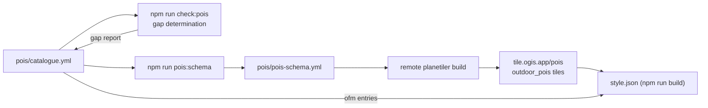

# Outdoor POIs (catalogue-driven)

> The outdoors style's point-of-interest system is **catalogue-driven**: [`pois/catalogue.yml`](../pois/catalogue.yml) is the single source of truth for which POIs render, where their data comes from, and how they look. This page covers the conceptual model (where a POI comes from, what this repo controls) and the light implementation reference (catalogue format, build consumption, schema generation, coverage checking). How the catalogue plugs into the build pipeline is covered in [The Style Build](1.build.md).

## 1. The layered model — where a POI comes from

Four layers, each a translation of the last:

- **OpenStreetMap** — raw tags on nodes/ways: `tourism=alpine_hut`, `amenity=drinking_water`, `leisure=park`, `historic=castle`. The universe of possible POIs.
- **OpenMapTiles schema (OMT)** — the translation layer. The `poi_class()` SQL function (see [`.cache/openmaptiles-poi-class.sql`](../.cache/openmaptiles-poi-class.sql)) maps tag combinations to classes (e.g. `amenity=pub`/`biergarten` → class `beer`; `leisure=park` → `park`); tag values with no explicit mapping fall through to the class itself.
- **Vector tiles** — the data. Every POI feature carries `class`, `subclass`, `name` and `rank`. Critically, **OMT poi data only exists from z14** — below that the poi layer carries only stations and ferry terminals ([`.cache/openmaptiles-poi-poi.sql`](../.cache/openmaptiles-poi-poi.sql)). Both SQL links in this list live in `.cache/`, a generated, gitignored directory produced by the build/download step — on a fresh clone they resolve only after a build has run.
- **The style** — decides what renders, at what zoom, with which icon. Liberty's style (our base) and this outdoor style are two different answers here. **This is the layer this repo works on.**

> [!WARNING]
> **The z14 data floor.** OMT poi features simply do not exist below z14 (only railway stations/halts and ferry terminals do). Any POI that renders below z14 must get its data from elsewhere — in this style, from the custom extract (sections 4–5).

Adding a POI to this style is never "add an icon to a style file". It is: declare the class in the catalogue (and optionally the tag map for the custom extract), make sure the Maki name exists, and the data flows from the right source.

## 2. What we keep from Liberty vs what we replace

- **Keep** — the openmaptiles tile source, the Maki sprite, the OMT schema mapping, and 46 of the Liberty base layers (all labels, roads, land, plus `poi_transit` re-filtered to railway + airport only, dropping bus stops).
- **Replace** — Liberty's three rank-tiered symbol layers (`poi_r1`/`poi_r7`/`poi_r20`) and their rendering rules, with the catalogue-driven `outdoor-poi-z1`/`outdoor-poi-z2`. None of the outdoor style's POI symbol layers originate from Liberty — they are all built here from the catalogue in [`scripts/build.mjs`](../scripts/build.mjs).

### Rank-based disclosure vs class allowlists — what "promotion" means

Liberty renders the **full OMT class universe**, but late, urban-biased and ranked: its three tiers show progressively more POIs per grid cell as you zoom in (z15 → z17), ordered by class importance — hospitals, transit, shops and bars first. Dense city cells fill up tier by tier; sparse rural cells show whatever few POIs they have.

Our catalogue replaces that per-cell ranking with **class allowlists**. When a Liberty POI "becomes ours", two things change:

1. **Zoom** — Liberty's z15/16/17 tiers become z14 for both catalogue tiers (tier 1 nominally declares z12; the OMT data floor makes it z14 in practice, and the custom extract covers the z12–13 window).
2. **Disclosure** — rank-based progressive disclosure is replaced by allowlists: every allowlisted class renders at its tier zoom regardless of importance, with only the flood-prone classes (park, bus, post) carrying optional density caps.

Predictability over per-cell ranking: the same class renders the same way in every cell — a park icon at the tier zoom is a park icon, not a rank casualty of its neighbours.

## 3. Maki icons: a naming convention, not a contract

Liberty's icon lookup is fully data-driven — the icon name **is** the class name (`["get","class"]` with no fallback). Classes without a Maki glyph silently render icon-less (e.g. `atm`; Liberty's `rail` class was dead because the sprite has `railway`, not `rail`).

Our catalogue deliberately decouples class/kind → icon with an explicit `"marker"` fallback (e.g. `atm` → `bank`, `hut` → `lodging`, `viewpoint` → `star_stroked`). The checker's sprite validation enforces that every icon name exists in the sprite, so a missing glyph fails the build instead of rendering silently.

> [!NOTE]
> **Maki is a naming convention, not a contract.** There is no promise that a class has a matching glyph. Liberty assumes it (and silently draws nothing when wrong); our catalogue maps explicitly, and the checker fails on any missing glyph.

## 4. The catalogue: one file, two sources

[`pois/catalogue.yml`](../pois/catalogue.yml) declares every POI the style cares about, in two kinds:

- **`source: ofm`** — a class allowlist: "render OMT class X at this tier". Tier 1 (priority classes) → `outdoor-poi-z1`; tier 2 (amenities) → `outdoor-poi-z2`. An optional `rank_max` caps density for flood-prone classes: park, bus and post are dense in cities and outrank shops in the OMT rank, so uncapped they would crowd everything else out of a cell.
- **`source: custom`** — an OSM tag selector (`include_when`) for the hosted extract tiles ([Tile Server & Hosted Overlays](7.server.md) — `tile.ogis.app/pois`, source-layer `outdoor_pois`), rendered by the `outdoor-poi` layer. These are the POIs OMT cannot serve — either below z14 or classes it cannot emit.

## 5. The custom extract's real role (not just a "z12–13 gap filler")

8 of the 18 custom kinds render **only** from the extract at every zoom: hut, viewpoint, pass, ranger_station, playground, skiing, bicycle, trailhead — and 4 of those (pass, ranger_station, skiing, trailhead) are classes OMT's poi layer cannot emit at all.

The other 10 kinds dual-source: the extract provides their below-z14 window, and at z14+ they render from both sources with identical icons and labels (harmless redundancy). They are park, castle, water (drinking_water), shelter, parking, picnic_site, information, toilets, campsite and ferry — each declared twice in the catalogue, once per source. Per-kind `min_zoom` gates when a kind appears within the extract's zoom range.

Custom extracts are **area-limited** — `geofabrik:italy` unless overridden (the schema generator's `--area` / `POI_AREA` overrides control the region — see [The schema generator](#the-schema-generator)).

## 6. The pipeline



Each step, and where it runs:

1. **Catalogue** — declare every POI (local source of truth, hand-maintained).
2. **`npm run check:pois`** — gap determination: dead ofm classes, zero-coverage classes, sprite-missing icons, rank caps; feeds the gap report back to the catalogue. Runs locally.
3. **`npm run pois:schema`** — generates `pois/pois-schema.yml` from the custom entries. Runs locally.
4. **Remote planetiler build** — the generated schema is the drop-in input; runs outside this repo — the feed is documented in [server.md](7.server.md).
5. **Hosted tiles** — `tile.ogis.app/pois`, source-layer `outdoor_pois`.
6. **`npm run build`** — reads the catalogue's ofm allowlists and wires the extract's `outdoor_pois` layer into `style.json`.

## 7. Implementation reference (light)

### Catalogue format

Each entry in [`pois/catalogue.yml`](../pois/catalogue.yml):

| Field          | Sources | Description                                                                |
| -------------- | ------- | -------------------------------------------------------------------------- |
| `id`           | both    | unique entry identifier                                                    |
| `source`       | both    | `ofm` (OpenMapTiles `poi` layer) or `custom` (hosted `outdoor_pois` tiles) |
| `class`        | ofm     | OMT `poi` class the entry renders (must exist in the OMT class universe)   |
| `tier`         | ofm     | `1` (priority classes) or `2` (amenities)                                  |
| `rank_max`     | ofm     | optional density cap on the OMT `rank`                                     |
| `icon`         | both    | Maki sprite icon name                                                      |
| `show_title`   | both    | whether the name label renders                                             |
| `include_when` | custom  | OSM tag map that selects the feature                                       |
| `kind`         | custom  | output `kind` attribute for the `outdoor_pois` layer                       |
| `min_zoom`     | custom  | feature-level zoom in the generated schema                                 |

### How build.mjs consumes the catalogue

The POI section of [`scripts/build.mjs`](../scripts/build.mjs) is one contiguous block: catalogue load → derived class/icon lists → constants → helpers → apply functions. The catalogue is parsed at build start; a missing or malformed `pois` array fails the build loudly. Layers render bottom → top:

```
peaks → park-label → custom outdoor-poi → outdoor-poi-z1 → outdoor-poi-z2 → poi_transit
```

- `tier: 1` → `outdoor-poi-z1`; `tier: 2` → `outdoor-poi-z2`. The class allowlists are the catalogue's tier classes. (Peaks and park-label are **not** catalogue-driven — they are kept byte-identical to their previous behaviour.)
- `poiIconMatch()` generates the icon-image match — class/kind → sprite icon with the `"marker"` fallback. `poiTextField()` emits the name label from a group's `show_title` flags (all true → plain name field; none → icon-only; mixed → a per-entry case).
- `rankCapCondition()` appends the rank caps to both tier filters; it returns null when a tier has no capped entries, keeping the plain filter shape.
- `poi_transit` is re-filtered to railway + airport only.

### The schema generator

[`scripts/generate-poi-schema.mjs`](../scripts/generate-poi-schema.mjs) (`npm run pois:schema`) writes [`pois/pois-schema.yml`](../pois/pois-schema.yml) from the catalogue's custom entries — one planetiler feature per entry, in catalogue order:

- Layer `outdoor_pois`, geometry `point`, with `include_when` and `min_zoom` copied from the entry.
- Attributes: `kind` (the entry's kind) and `name` (from the OSM `name` tag); kinds `hut`, `shelter`, `viewpoint`, `pass` also carry `ele`.
- Source: `osm` with the extract area — `geofabrik:italy` unless overridden with `--area=geofabrik:world` or the `POI_AREA` env var.
- The output file is marked GENERATED — change the catalogue, not the schema.

### The coverage checker

[`scripts/check-poi-coverage.mjs`](../scripts/check-poi-coverage.mjs) (`npm run check:pois`) cross-checks the catalogue against the live OpenMapTiles `poi` schema, the built `style.json`, and the sprite sheet:

- **Upstream schema sync** — ETag-cached OMT `poi` files; the class universe and how the class is computed.
- **Dead/zero-coverage detection** — ofm classes OMT can never emit (these render nothing and must be fixed), custom kinds OMT already ingests (promotion candidates), and ofm classes the built style has no filter for (regression bug).
- **Sprite icon validation** — fetches the style's sprite JSON and validates every icon-image literal; missing icons fail.
- **Gap report** — advisory: ofm entries whose desired zoom sits below the OMT data floor, with each entry's custom-coverage status and an OSM-tag suggestion when uncovered.

Exit code is 0 only when fully green: no dead ofm entries, no zero-coverage classes, no sprite-missing icons, no rank-cap issues.

## 8. Known data realities

- **OMT `poi` data starts at z14** — tier 1's z12 ambition renders from z14 in practice.
- **Density caps** — park, bus and post carry `rank_max`; they outrank shops in the OMT rank, so uncapped they would flood city cells at the tier zoom.
- **`atm` uses the `bank` icon** — the Maki sprite has no `atm` glyph.
- **Custom extracts are area-limited** (`geofabrik:italy` unless overridden) — outside that area only the ofm path provides POIs.
- **Custom `min_zoom` values below the extract floor are floored at 12** — the extract cannot serve earlier.

## Related

- [Docs index](README.md)
- [The Style Build](1.build.md) — how the catalogue plugs into the build pipeline
- [Style structure — §18 / §21](2.style.md) — layer-by-layer style details
- [Tile Server & Hosted Overlays](7.server.md) — tile generation (planetiler YAML vs Java profile)
- [`pois/catalogue.yml`](../pois/catalogue.yml) · [`pois/pois-schema.yml`](../pois/pois-schema.yml) · [`scripts/check-poi-coverage.mjs`](../scripts/check-poi-coverage.mjs) · [`scripts/generate-poi-schema.mjs`](../scripts/generate-poi-schema.mjs)
