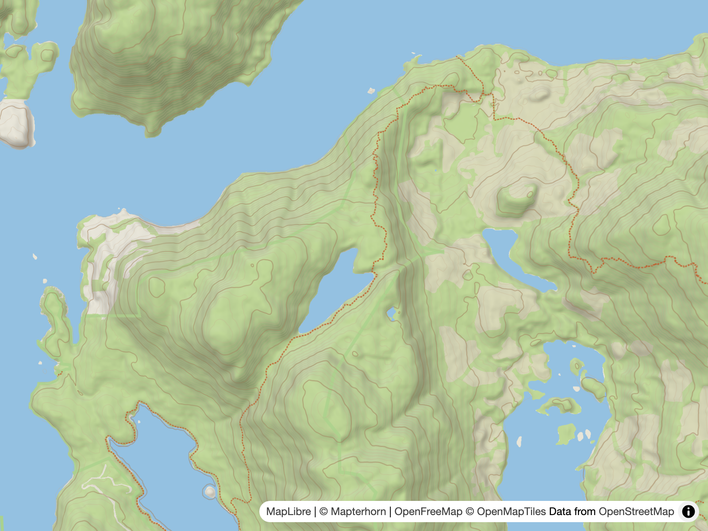

# Outdoor POIs

> POIs for the outdoors.

## Two Tiers

The outdoor POI system is two-tiered, both config-driven:

- **Overlay** — the hosted extract. [`applyOutdoorPoi()`](../scripts/build.mjs) adds the `outdoor-poi` vector source (`https://tile.ogis.app/pois/{z}/{x}/{y}.pbf`, source-layer `outdoor_pois`, z12–16) and the `outdoor-poi` symbol layer (minzoom 12). This tier carries the kinds OMT lacks entirely (trailhead, pass, ranger_station, lighthouse, skiing…) and the kinds the overlay wants from z12 rather than OMT's z14 data floor.
- **Planet layer** — OMT data rendered directly. The `outdoor-amenities` symbol layer draws three OMT `poi` classes (doctors, bank, bicycle_rental) straight from the basemap's `openmaptiles` source at z14+, with no hosted extract.

The two layers stack just above the basemap's POI stack (`Zoo`): `outdoor-amenities` directly above it, `outdoor-poi` above that (so overlay POIs win collisions), both below the contour labels.

## Config — `scripts/poi-config.mjs`

[`scripts/poi-config.mjs`](../scripts/poi-config.mjs) is the single source of truth for both tiers, imported by the build, the schema generator and the checker so the three can never drift.

[`OUTDOOR_POI`](../scripts/poi-config.mjs) drives the overlay: `sourceId`, `tileUrl`, `sourceLayer`, the zoom bounds and the `kinds` array (18 kinds). Each kind declares:

- **kind** — the category value carried by the tiles
- **icon** — the sprite glyph: basemap icons bare (unprefixed); outdoors-owned icons always prefixed `outdoors:` (see [Extending the Icon Set](#extending-the-icon-set))
- **handoffZoom** — the zoom at which the basemap's own POI layer takes over (`null` = the basemap never draws that kind)
- **showEle** — whether the label includes the elevation

| kind             | icon                 | handoff | notes                                         |
| ---------------- | -------------------- | ------- | --------------------------------------------- |
| `hut`            | `alpinehut`          | 17      | basemap Accommodation z17; elevation in label |
| `shelter`        | `shelter`            | —       | no basemap layer; elevation in label          |
| `viewpoint`      | `viewpoint`          | 15      | basemap Attraction z15; elevation in label    |
| `campsite`       | `camping`            | 16      | basemap Campsite z16                          |
| `picnic_site`    | `picnic`             | —       | no basemap layer                              |
| `drinking_water` | `drinking_water`     | 18      | basemap Waste z18                             |
| `trailhead`      | `outdoors:trailhead` | —       | outdoors sheet; no basemap layer              |
| `pass`           | `outdoors:pass`      | —       | outdoors sheet; elevation in label            |
| `ranger_station` | `wilderness_hut`     | —       | icon in basemap sheet; elevation in label     |
| `castle`         | `castle`             | 15      | basemap Cultural z15                          |
| `information`    | `office`             | 16      | basemap Public z16                            |
| `parking`        | `parking`            | 17      | basemap Transport z17                         |
| `park`           | `outdoors:park`      | 15      | outdoors sheet; basemap Local park z15        |
| `toilets`        | `toilets`            | 18      | basemap Waste z18                             |
| `playground`     | `playground`         | 16      | basemap Outdoor z16                           |
| `ferry`          | `ferry`              | 15      | basemap Ferry z15                             |
| `lighthouse`     | `lighthouse`         | —       | no basemap layer                              |
| `skiing`         | `outdoors:skiing`    | —       | outdoors sheet; no basemap layer              |

[`PLANET_POI`](../scripts/poi-config.mjs) drives the planet tier: it reuses the basemap's existing `openmaptiles` source (source-layer `poi`, minzoom 14), and its `kinds` array declares three OMT classes:

| class            | icon             | label       |
| ---------------- | ---------------- | ----------- |
| `doctors`        | `doctors`        | icon only   |
| `bank`           | `bank`           | icon only   |
| `bicycle_rental` | `rental_bicycle` | icon + name |

Each entry declares `class`, `icon` and `showTitle` (whether the label includes the name). The icons live in the basemap's default sprite, with an `outdoors:dot` fallback that never renders since every class has an explicit icon.

## Handoff

Each overlay kind renders only below its handoff zoom (`POI_FILTER`); at/above it the basemap's own POI layer named in the table takes over (Attraction z15, Cultural z15, Ferry z15, Local park z15, Campsite z16, Outdoor z16, Public z16, Accommodation z17, Transport z17, Waste z18), so there are no duplicates and no gaps. Labels are `name` plus elevation for the `showEle` kinds (`POI_TEXT_EXPR`); icons map kind → sprite glyph via `POI_ICON_MATCH`, with `outdoorIcon()` prefixing the outdoors-owned icons and an `outdoors:dot` fallback that never renders, since every kind has an explicit icon.

The planet layer has no handoff — it draws classes no basemap POI filter matches (`doctors`, `bank`, `bicycle_rental`), directly from the same `openmaptiles` source the basemap reads.

> [!NOTE]
> **Deploy dependency** — the five outdoors-owned icons (trailhead, pass, park, skiing and the dot fallback) live in the outdoors sheet and are referenced with the `outdoors:` prefix; the sheet is served from an absolute URL (`https://www.ogis.org/outdoors/sprite`) that only exists once the demo deploys — the icons render on the deployed site. See [Extending the Icon Set](#extending-the-icon-set).

## Schema — `pois/pois-schema.yml`

`npm run pois:schema` runs [`scripts/generate-poi-schema.mjs`](../scripts/generate-poi-schema.mjs), which reads `OUTDOOR_POI` and writes [`pois/pois-schema.yml`](../pois/pois-schema.yml) — a **GENERATED** Planetiler YAML schema (do not edit by hand): one feature per kind (18 in all), centroid geometry, `min_zoom` 12, attributes `kind`/`name` (plus `ele` for `showEle` kinds), and `include_when` OSM-tag selectors per kind from the `INCLUDE_WHEN` map. The extract area defaults to `geofabrik:italy`, overridable with `--area=` or the `POI_AREA` environment variable.

## Checker — `npm run check:pois`

[`scripts/check-poi-coverage.mjs`](../scripts/check-poi-coverage.mjs) runs four checks against the built `style.json`, the config and the schema, exiting 1 on any failure:

1. **Sprite validation** — every literal `icon-image` value in `style.json` must exist in its **own sheet** (never the union): bare values in the basemap sprite (`https://www.ogis.org/basemap/sprite.json`, ETag-cached), `outdoors:`-prefixed values in the local outdoors sheet (`dev/public/sprite.json`, built by `npm run sprite:build` — the check fails with a clear error telling you to run it if the sheet is missing). A prefixed value is split at its first `:` and resolved against the named sheet. Token templates (`{subclass}`) and dynamic expressions are resolved at render time and skipped. Plus an **orphan check** — every icon key in `dev/public/sprite.json` must be referenced with the `outdoors:` prefix somewhere in `style.json`, so the sheet can never silently grow an icon that `OUTDOOR_SPRITE_ICONS` forgets.
2. **Kind coverage** — the `outdoor-poi` layer exists, references the `outdoor-poi` source, and every kind in `OUTDOOR_POI.kinds` appears in its filter.
3. **Schema sync** — the kind set in `pois/pois-schema.yml` matches `OUTDOOR_POI.kinds`.
4. **Planet layer** — the `outdoor-amenities` layer exists with the correct source/source-layer/minzoom, and its filter contains every class in `PLANET_POI.kinds` (its icons are already covered by check 1).

## Extending the Icon Set

Outdoors owns a small sprite sheet of its own, layered over the basemap's. Drop an OpenMapTiles-style SVG in `icons/`, run `npm run sprite:build`, and reference it as `outdoors:<name>` in a layer — the build wires the sheet into `style.json`'s `sprite` array, and `npm run check:pois` validates every `icon-image` against its own sheet (bare → basemap, prefixed → named) plus the orphan check. See [Style Structure](2.style.md).

---

**← [Paths](3.paths.md) · [Elevation & Terrain](5.dem.md) →**
