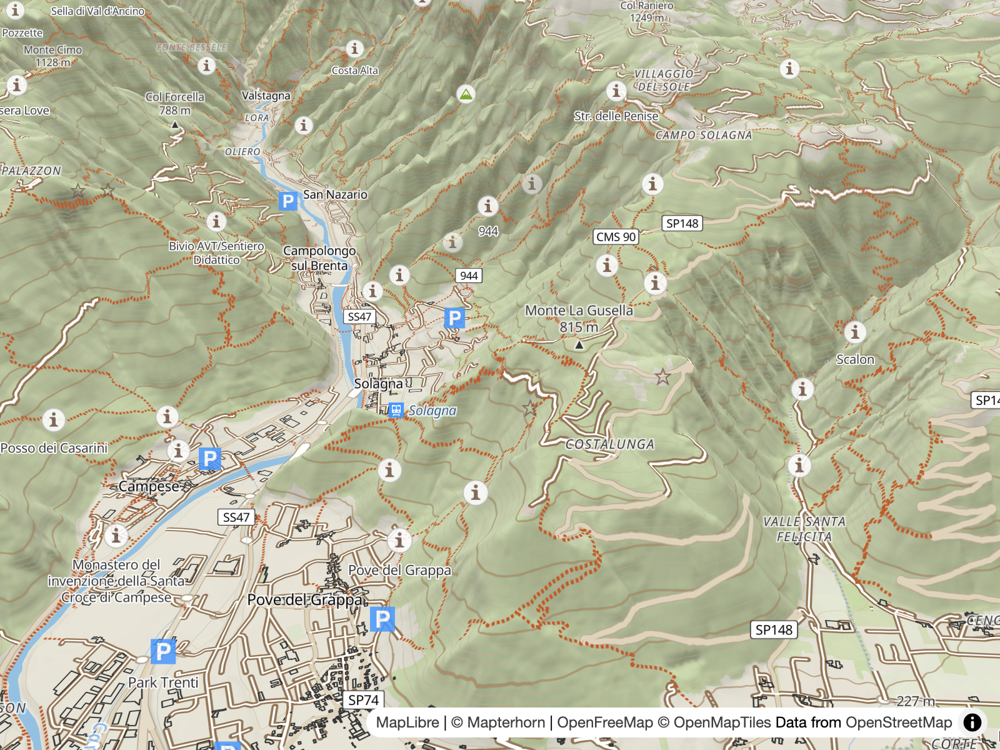
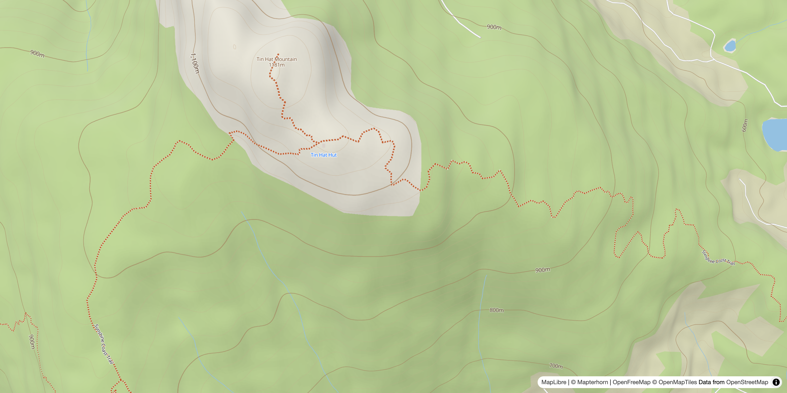

# Elevation & Terrain

> Hillshading, terrain relief and contours powered by Mapterhorn.

[](https://www.ogis.org/outdoors/#13.03/45.81048/11.73434/-27.6/60)

The build script wires the DEM in once as a `raster-dem` source (`demSource`), which feeds the two client-rendered consumers directly:

- **Hillshade** — a `hillshade` layer that fades in across the low zooms.
- **Terrain** — the style's `terrain` property, enabling 3D relief in clients that support it.

The same endpoint feeds the hosted contour service:

- **Contours** — server-generated PBF contour tiles, styled as lines and elevation labels.

## Hillshade

`applyDemHillshade()` adds the `hillshade-layer` (type `hillshade`, source `demSource`). Its `hillshade-exaggeration` paint is a linear zoom ramp — 0 at z3 → 0.2 at z5 → 0.2 at z12 (constant `HILLSHADE_EXAGGERATION`) — so relief fades in across the low zooms and stays steady through the mid-range. The layer is inserted at the water stack index (above landcover/landuse, below water).

## Terrain

`applyDemTerrain()` sets the style's `terrain` property:

```js
style.terrain = { source: "demSource", exaggeration: TERRAIN_EXAGGERATION };
```

`TERRAIN_EXAGGERATION` is 1.5 — the ratio by which the terrain is exaggerated relative to the real world. Declaring `style.terrain` enables 3D terrain rendering: clients that support the style-spec `terrain` property (MapLibre GL JS / MapLibre Native) lift the map surface from the DEM, so pitched views show genuine relief.

## Contours

[](https://www.ogis.org/outdoors/#15.3/49.980138/-124.377551)

The contour overlay is the server-side consumer of the same DEM: the hosted tile service rasterises contours from the Mapterhorn DEM and serves them as PBF vector tiles, which the style fetches and styles like any other vector source. The overlay is gated by the `CONTOURS` toggle.

### Tile Server

Tiles are generated on demand by the hosted [contour-mvt-server](https://github.com/acalcutt/contour-mvt-server) at `tile.ogis.app` — marching squares over the Mapterhorn DEM, the same `tiles.mapterhorn.com` endpoint the style fetches for the hillshade and terrain. See [Contour Service](7.server.md#contour-service).

### Layers

Two layers are added by `applyContours()` and `applyContourLabels()` in [`scripts/build.mjs`](../scripts/build.mjs). `contour-lines` is inserted at the water stack index (above landcover, below water); `contour-labels` is inserted below the POI stack at build time and then repositioned by `reorderContourLabelStack()` in `build()` to its final slot above the POI tiers — see [Label placement](#label-placement) below.

| Layer            | Type   | Purpose                                                                                                                                                                              |
| ---------------- | ------ | ------------------------------------------------------------------------------------------------------------------------------------------------------------------------------------ |
| `contour-lines`  | line   | Minor and index contours in a single layer — a `case` expression on the elevation value switches style per line, hiding lines that fall off the 20 m minor cadence (`ele % 20 == 0`) |
| `contour-labels` | symbol | Line-placed elevation text, emitted only on index lines                                                                                                                              |

Both layers are styled from the central `COLOURS` object in [`scripts/build.mjs`](../scripts/build.mjs) — `COLOURS.CONTOURS` holds the minor/index/label colours — with the width and opacity ramps below. See [The Style Build](1.build.md) for how the colour object and per-feature config work.

### Line Rendering

The single `contour-lines` layer distinguishes index contours (every 100 m, `ele % 100 === 0`) from the minor lines between them with a `case` expression, then paints both through three-stop zoom ramps (z9 → z13 → z14) defined in `applyContours()` and the `CONTOUR_OPACITY_*` / `CONTOUR_WIDTH_*` constants. `CONTOUR_MID_ZOOM` (z13) is the middle stop and sets ramp position.

| Zoom stop | Index opacity | Minor opacity | Index width | Minor width |
| --------- | ------------- | ------------- | ----------- | ----------- |
| z9        | 0.4           | 0.35          | 0.75 px     | 0.4 px      |
| z13       | 0.64          | 0.47          | 1.1 px      | 0.45 px     |
| z14       | 0.7           | 0.5           | 1.6 px      | 0.7 px      |

See [`scripts/build.mjs`](../scripts/build.mjs) for more details.

### Label Placement

MapLibre resolves symbol collisions from the top of the stack down — the highest label layer places first and wins the space. `contour-labels` is therefore inserted low at build time (below the POI stack) and then repositioned by `reorderContourLabelStack()`, a post-pass called in `build()` after the outdoor-POI steps, to sit directly above the POI tiers (`outdoor-poi-z1`/`z2`, `outdoor-poi`, `outdoor-paths`) and below the peak tiers (`mountain-peak`, `mountain-peak-secondary`, `mountain-saddle`, `mountain-volcano`) and `park-label`. The collision order this produces:

- peaks and park labels win over contour labels;
- contour labels win over POI labels;
- town/place labels (above all of these) still win.

Without the repositioning the layer would sit at the bottom of the symbol stack and lose to every other label layer, so elevation text would only appear when the map overzoomed past the label-dense zooms.

### Label layout

`contour-labels` places text along the line (`symbol-placement: line`) with `text-padding: 4` and a `text-size` ramp of 11 px @ z12 → 13 px @ z14 — the tighter padding lets elevation text fit along more of each line. Labels stay metric at build time (see [Units](#units)).

### Zoom ceiling

> [!WARNING]
> **Do not raise the source maxzoom above z14** — contours stair-step visibly at z15+.

The limit is fundamental: contour geometry follows the raster DEM's pixel grid, so beyond the supported zoom the grid shows up as stair-stepping. Why that is, and the z9–14 source range it forces, are explained in [Tile Server & Hosted Overlays](7.server.md).

### Units

The style ships metric-only — the label expression renders the rounded `ele` value with an `"m"` suffix. Imperial conversion is a client-side concern, not part of the style. See [Metric vs Imperial](6.client.md#metric-vs-imperial).

## Other elevation data

Not every elevation value in the style comes from the Mapterhorn DEM:

- **OMT peak labels** — `mountain-peak`, `mountain-peak-secondary`, `mountain-saddle` and `mountain-volcano` (built by `applyPeakLabels()`) carry `{ele} m` from the OpenMapTiles `mountain_peak` source-layer — vector-tile attributes, not the DEM. See [Peak labels](2.style.md#pois--labels).
- **POI `ele` attribute** — the outdoor-POI kinds `hut`, `shelter`, `viewpoint` and `pass` carry an `ele` attribute from OSM tags (`ELE_KINDS` in [`scripts/generate-poi-schema.mjs`](../scripts/generate-poi-schema.mjs)), written into the generated [`pois/pois-schema.yml`](../pois/pois-schema.yml).
- **Base Natural Earth relief** — the Liberty base's pre-shaded relief raster (`ne2_shaded` source, maxzoom 6, layer `natural_earth`) is inherited from the base style, not DEM-derived. See [Style Structure](2.style.md).

---

**← [Outdoor POIs](4.pois.md) · [Client-side rendering](6.client.md) →**
