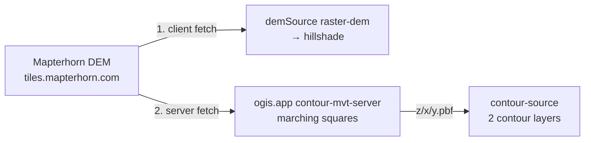

# Tile Server

> The Tile Server augments existing data with outdoor POIs, low-zoom paths and contours.

The tile server implementation lives outside this repository. See [`pois/pois-schema.yml`](../pois/pois-schema.yml) and [`examples/FootpathOverlay.java`](examples/FootpathOverlay.java) for details.

## Endpoints

Three services run behind `tile.ogis.app`, all planet-wide with open CORS:

| Service  | Endpoint                   | Source-layer    | Geometry | Zooms  | Fed by                                                           |
| -------- | -------------------------- | --------------- | -------- | ------ | ---------------------------------------------------------------- |
| POIs     | `/pois/{z}/{x}/{y}.pbf`    | `outdoor_pois`  | point    | z12–16 | [`pois/pois-schema.yml`](../pois/pois-schema.yml)                |
| Paths    | `/paths/{z}/{x}/{y}.pbf`   | `outdoor_paths` | line     | z9–13  | [`examples/FootpathOverlay.java`](examples/FootpathOverlay.java) |
| Contours | `/terrain/{z}/{x}/{y}.pbf` | `contours`      | line     | z9–14  | the contour service — on demand, not fed by this repo            |

## POIs schema

[`pois/pois-schema.yml`](../pois/pois-schema.yml) is a **GENERATED** Planetiler YAML schema — do not edit it by hand — defining the `outdoor_pois` layer with point geometry. [`scripts/generate-poi-schema.mjs`](../scripts/generate-poi-schema.mjs) (`npm run pois:schema`) writes it from the `custom` entries of [`pois/catalogue.yml`](../pois/catalogue.yml): one planetiler feature per entry, with `include_when` and `min_zoom` copied from the entry, and attributes `kind` and `name` (plus `ele` for hut/shelter/viewpoint/pass). The source is `osm` with the extract area `geofabrik:italy` unless overridden (`--area` / `POI_AREA`). The catalogue side is documented in [Outdoor POIs](4.pois.md).

### `FootpathOverlay.java` — the paths profile

[`examples/FootpathOverlay.java`](examples/FootpathOverlay.java) is a Planetiler Java profile emitting the `outdoor_paths` layer (z9–13). It matches `highway=path|footway|track` and follows the standard Planetiler three-phase structure — `preprocessOsmRelation`, `processFeature`, `postProcessLayerFeatures`. The overlay exists because the OpenMapTiles base schema zoom-gates path data — nothing below z12, only route members at z12–13, all paths from z14 — so the base map renders no paths at low zoom and the overlay supplies the z9–13 window.

The **density strategy** mirrors the Mapzen/Tilezen proposal ([vector-datasource #596](https://github.com/mapzen/vector-datasource/issues/596)): route-gated below z12 — iwn → z9, nwn → z10, rwn → z11, lwn → z12, no membership → z12 (all paths from z12). Each emitted feature carries `class`, `network`, and optional `name` / `sac_scale`.

- **Scope:** path + track + footway — the full recommended set, flippable in one line of the profile if the source is ever rebuilt (~78 M ways worldwide, taginfo 2026-08).
- **Route relations:** paths are emitted for hiking/foot/walking route membership only — cycling/mtb deliberately excluded.
- **Local-dev shortcut:** the profile's `--area=italy` default is for fast test builds; production builds run from the full planet PBF.

Tile-side references behind the paths overlay:

- OpenMapTiles schema: <https://openmaptiles.org/schema/> — transportation layer zoom gating
- [PR #1334](https://github.com/openmaptiles/openmaptiles/pull/1334) (merged) — fixed z12/z13 path/track gating; and its predecessors [PR #1190](https://github.com/openmaptiles/openmaptiles/pull/1190) (selective rendering) / [PR #1186](https://github.com/openmaptiles/openmaptiles/pull/1186) (abandoned all-paths attempt)
- [Issue #271](https://github.com/openmaptiles/openmaptiles/issues/271) — "Show track/path sooner" — the overlay workaround
- Data volume: <https://taginfo.openstreetmap.org/> · Planet PBF: <https://planet.openstreetmap.org/>
- OpenFreeMap (unmodified OMT schema, weekly Planetiler builds): <https://github.com/hyperknot/openfreemap> · styles: <https://github.com/hyperknot/openfreemap-styles>
- Alternatives considered: Waymarked Trails raster (<https://waymarkedtrails.org>), MapTiler Outdoor `trail` layer (<https://docs.maptiler.com/schema/outdoor/>) — route-centric or closed; raw OSM + Planetiler remains the source of record

## Why two generation approaches

The POIs and paths use different generators because the underlying OSM data has two different shapes:

- **POIs are individual point features with tags** (`tourism=alpine_hut`, `amenity=drinking_water`), so a declarative **YAML schema** can match each tag combination: `include_when` selects the feature, `attributes` maps it to a `kind`.
- **Paths are relation-driven line features** — density is gated by relation membership (the network tiers) and the geometry lives on the member ways — so a declarative schema cannot express them. An imperative **Java profile** works in three phases: preprocess the relation, emit a line feature per member way, then merge touching line segments.

## Contour Service

The contour service is separate from the fed services: an on-demand service, not fed by this repo. The hosted [contour-mvt-server](https://github.com/acalcutt/contour-mvt-server) at `tile.ogis.app` rasterises contours with marching squares over the **Mapterhorn DEM**:

- DEM endpoint: `https://tiles.mapterhorn.com/{z}/{x}/{y}.webp` — Terrarium-encoded WebP, standard Web Mercator XYZ
- DEM source: Copernicus GLO-30 global base + national/regional LiDAR layers on top
- Attribution required: `© Mapterhorn` (per their TileJSON attribution)

The **same** Mapterhorn endpoint is consumed in two places — client-side as the `demSource` raster-dem that feeds the hillshade layer, and server-side by the contour service — so one provider serves the whole terrain stack:

The same tile URL is therefore fetched twice — once by the client, once by the tile server — but the CDN serves the second request from cache, so the extra fetch is effectively free.

**Server configuration gotchas** when replicating the service with contour-mvt-server: the source must point at Mapterhorn's Terrarium WebP tiles and its key must match the URL path the style requests (`terrain`); the config must emit source-layer `contours` with `ele`/`level` properties and per-zoom thresholds; and the blank-tile size must match Mapterhorn's own tile size — the server ships with a smaller blank-tile size that would render blank contour tiles at the wrong scale. See the project's own [documentation](https://github.com/acalcutt/contour-mvt-server) for the full configuration reference.

**Zoom ceiling rationale:** PBF contours are generated by marching squares over the raster DEM's pixel grid, and geometry follows pixel boundaries. Beyond the supported zoom the underlying DEM grid becomes visible as stair-stepping — a fundamental limit of server-side contour generation from raster DEM data. The style-side consequence (including the "do not raise the source maxzoom above z14" warning) is documented in [Elevation & Terrain](5.dem.md).

## Production notes

The hosted services are built from the **full planet PBF** on a machine sized for planet builds (Planetiler needs substantial RAM and scratch disk). The output is a pmtiles archive served by a pmtiles → zxy server behind `tile.ogis.app` serving `/pois/` and `/paths/`. A paths-only build is substantially cheaper than a full OMT profile (no buildings/POIs/landcover passes), so the hosted service can be refreshed on demand rather than on a fixed schedule. Precedent: OpenFreeMap itself builds the unmodified OMT schema planet-wide weekly with Planetiler.

Tile output is verified live on `tile.ogis.app`: profiles are checked locally on the Italy extract (Dolomites bounds), and the hosted endpoints return gzipped MVT at every zoom in their range.

**Attribution** is declared server-side: the Java profiles set `isOverlay() = true` with attribution `© OpenStreetMap contributors`, while the style-side `TILES_ATTRIBUTION` constant in [`scripts/build.mjs`](../scripts/build.mjs) is blank so the attribution control does not duplicate the OSM credit.

---

**← [Previous: Client-side rendering](6.client.md) · [Next: Hiking Routes](8.activities.md) →**
