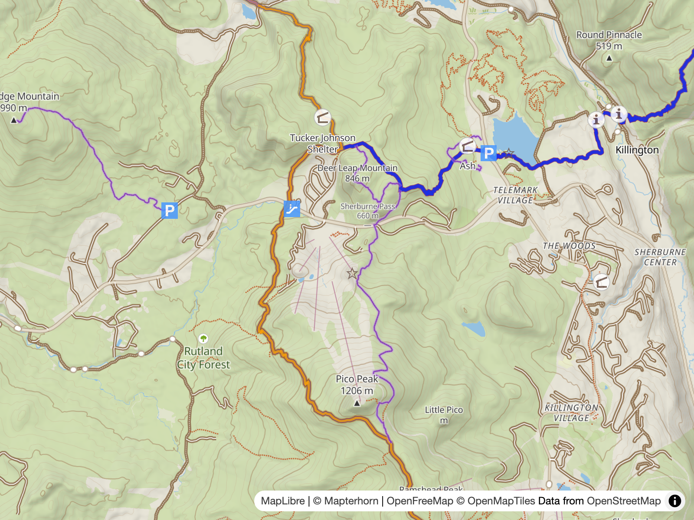
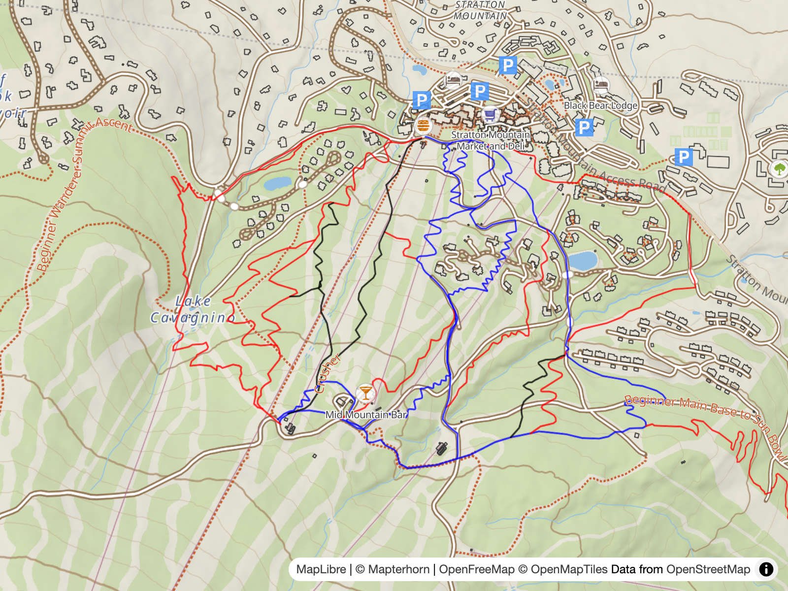

# Activities

> Outdoors is currently activity agnostic

While the following activity based overlays were considered, the style is currently activity agnostic, instead of trying to cater to any specific activities.

> [!NOTE]
> While currently disabled, the following examples remain available behind `OUTDOOR_ROUTE` / `MTB_SCALE` feature toggles in [`scripts/build.mjs`](../scripts/build.mjs).

## Hiking Routes

The hiking routes overlay turns OSM hiking route relations (`type=route|superroute`, `route=hiking|foot|walking`) into line vector tiles, so long-distance routes read as a hierarchy on the map.

The Planetiler profile is [`examples/HikingRouteOverlay.java`](examples/HikingRouteOverlay.java), based on Planetiler's [BikeRouteOverlay example](https://github.com/onthegomap/planetiler/blob/main/planetiler-examples/src/main/java/com/onthegomap/planetiler/examples/BikeRouteOverlay.java). It emits an `outdoor_routes` layer (z8–14) hosted at `tile.ogis.app/routes`; the style-side rendering is section 20 "Outdoor routes" in [Style Structure](2.style.md).

Thanks to [Waymarked Trails: Hiking](https://hiking.waymarkedtrails.org/#help-about), lots of useful information there, which also offers cycling, mtb, riding (equestrian), skating and slopes (skiing) in addition to hiking.

## MTB Scale

The MTB scale overlay colours ways by mountain bike difficulty, using the [`mtb_scale`](https://wiki.openstreetmap.org/wiki/Key:mtb:scale) from the OpenMapTiles transportation source-layer. Based on [this comment](https://github.com/hyperknot/openfreemap/issues/31#issuecomment-4649028862).

This example works well, but different rating systems exist like [mtb:scale:imba](https://wiki.openstreetmap.org/wiki/Key:mtb:scale:imba), which are not included in the tile schema.

---

**← [Tile Server](7.server.md)**
