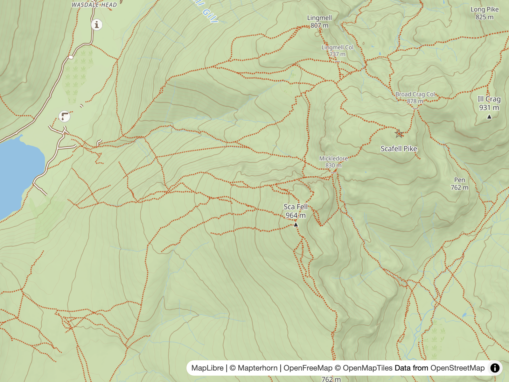
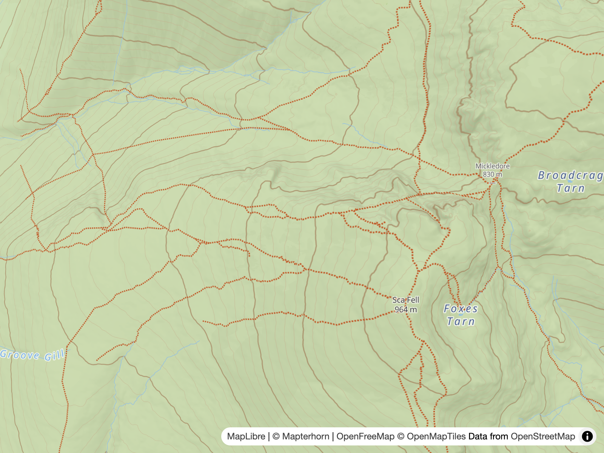
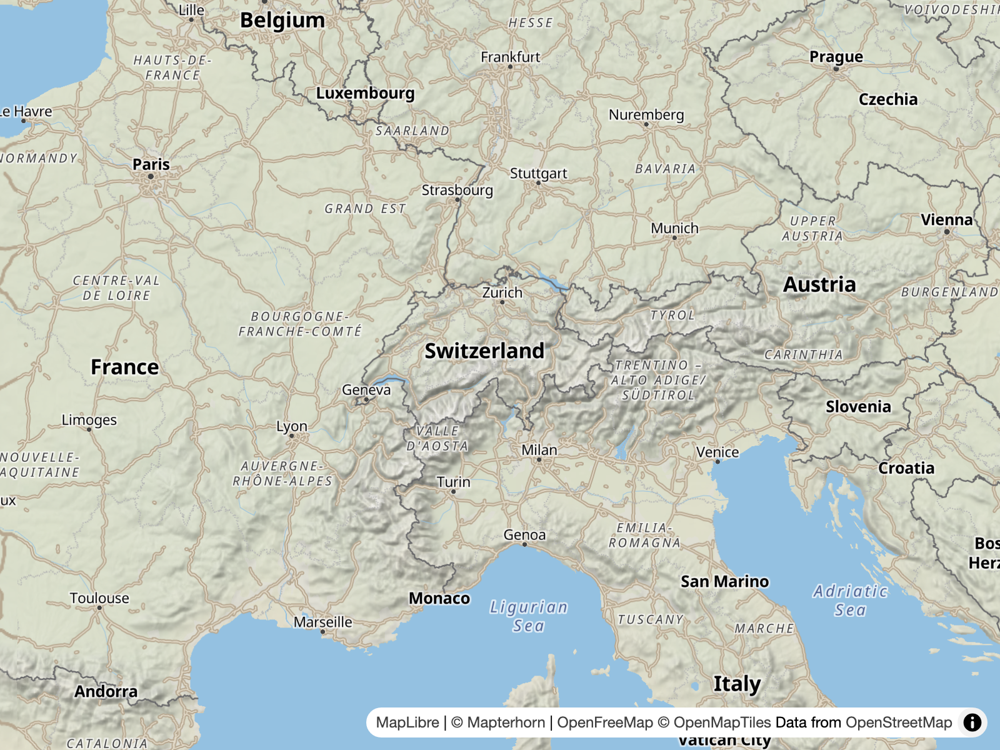
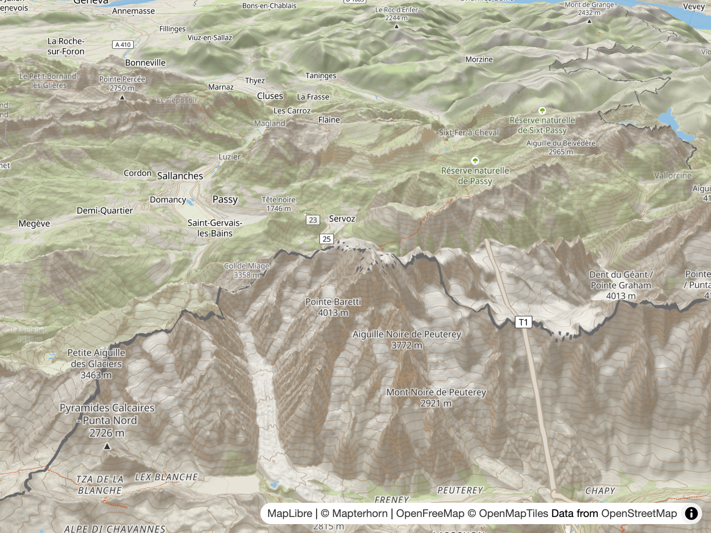
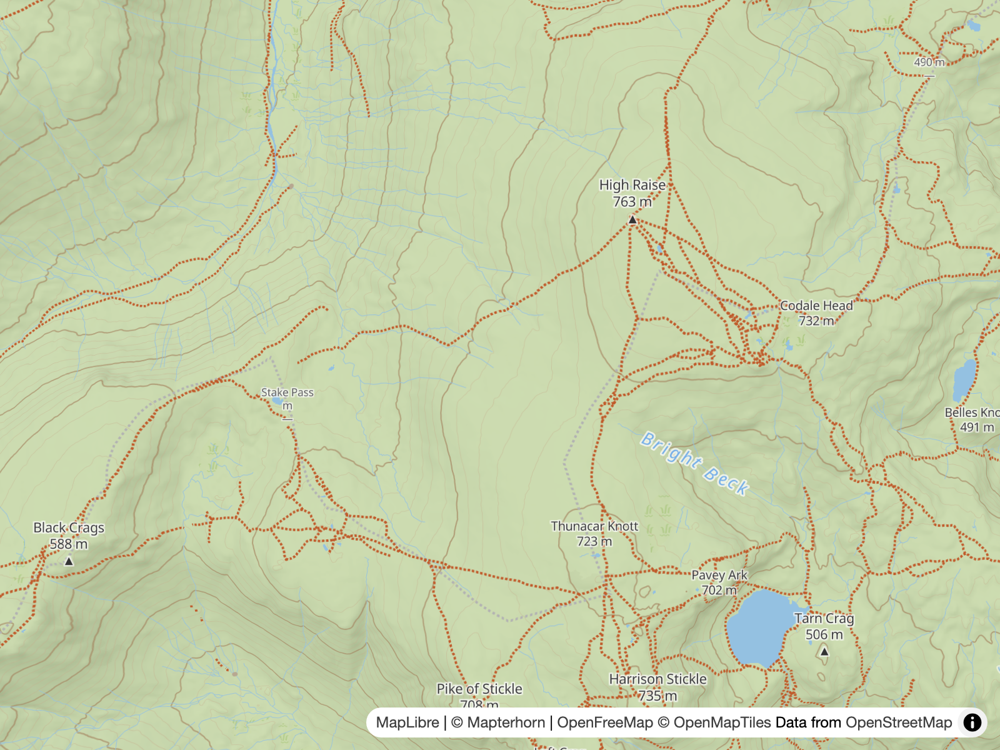
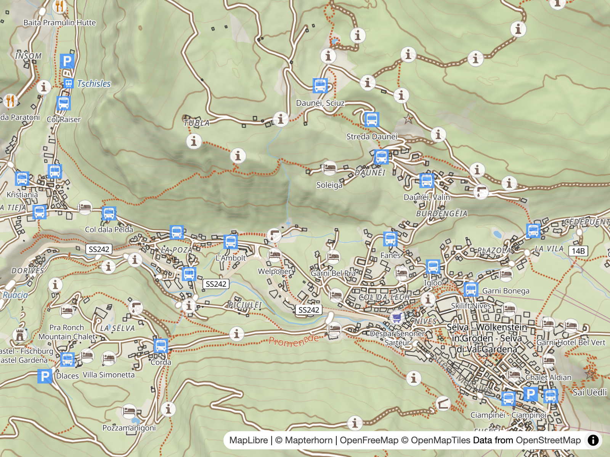
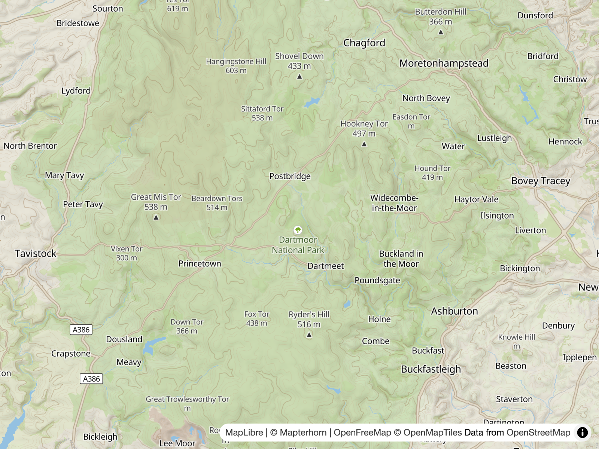

# Screenshots

> **A Playwright-based dev tool that renders the current `style.json` to PNGs** — a headless Chromium runner driven by an editable shot list, so every feature the docs describe has a visual counterpart that can be regenerated on demand.

## Overview

`npm run screenshots` runs [`scripts/screenshots/generate.mjs`](../scripts/screenshots/generate.mjs), which serves the built style to a headless MapLibre page and captures it at the locations and zooms declared in [`scripts/screenshots/shots.json`](../scripts/screenshots/shots.json). Each PNG is written to the git-tracked `screenshots/` directory at the project root.

The shots always render the **current built `style.json`** — regenerate them whenever the style changes. The command is deliberately standalone: it is not hooked into the build or watch pipeline, so it only runs when asked.

## Setup & Usage

One-time setup downloads the headless Chromium binary that Playwright drives:

```bash
npx playwright install chromium
```

Then:

```bash
npm run screenshots                  # regenerate every shot in shots.json
npm run screenshots -- --name <id>   # regenerate a single shot by id
```

A run exits non-zero if any capture fails. Console and page errors are collected per shot and reported as warnings — they don't fail the run.

## How it works

- `generate.mjs` starts a tiny `node:http` static server bound to `127.0.0.1`, scanning ports 11000–11999 for a free one (`startServer()`). The range never collides with the dev servers on 5173/8000, and binding IPv4 loopback avoids confusion with session Vite dev servers on `::1`.
- The server serves [`harness.html`](../scripts/screenshots/harness.html) plus `/style.json` and the MapLibre UMD bundle from `node_modules/maplibre-gl/dist`.
- For each shot, a fresh headless browser context is launched at the shot's viewport and `deviceScaleFactor` (`scale`, default 2) — 800×600 CSS pixels at scale 2 yields a ~1600×1200 px PNG — and navigates to the harness with `center`, `zoom`, `bearing` and `pitch` as query params (`shotUrl()`).
- The harness page creates a non-interactive MapLibre map (`fadeDuration: 0`, attribution shown), collects errors into `window.__mapErrors`, and sets `window.__shotReady` once the map is idle plus a 400 ms settle (30 s fallback). The runner waits on that flag (`captureShot()`), then screenshots the viewport clip to `screenshots/<id>.png`.

## Adding or changing a shot

Shots are declared in [`scripts/screenshots/shots.json`](../scripts/screenshots/shots.json). Each entry needs an `id`, `label`, `center` (`[lng, lat]`), `zoom`, `width` and `height`, with optional `bearing`, `pitch` and `scale`. Edit the list, then `npm run screenshots` — or `--name <id>` to regenerate just the new or changed one (an unknown id fails with the list of known ids).

## The shot list

| id                               | illustrates                                                                  | location                                              |
| -------------------------------- | ---------------------------------------------------------------------------- | ----------------------------------------------------- |
| `contours-lake-district-z13`     | Contour overlay at mid zoom — see [Elevation & Terrain](5.dem.md)            | Scafell Pike, Lake District · [-3.23, 54.45] z13      |
| `contours-lake-district-z14`     | Contours at high zoom — denser index/minor hierarchy                         | Scafell Pike, Lake District · [-3.23, 54.45] z14      |
| `hillshade-alps-z5`              | 2D hillshade fading in at low zoom — see [Elevation & Terrain](5.dem.md)     | Alps · [8.5, 46.5] z5                                 |
| `terrain-alps-pitched`           | 3D terrain in a pitched view — see [Style Structure](2.style.md)             | Mont Blanc · [6.86, 45.83] z11, bearing −30, pitch 60 |
| `paths-lake-district-z13`        | Promoted footpaths and the hosted low-zoom overlay — see [Paths](3.paths.md) | Lake District · [-3.12, 54.47] z13                    |
| `pois-dolomites-val-gardena-z14` | Outdoor POIs (viewpoints, information) — see [Outdoor POIs](4.pois.md)       | Val Gardena, Dolomites · [11.75, 46.56] z14           |
| `park-dartmoor-z10`              | National park fills and outlines — see [Style Structure](2.style.md)         | Dartmoor · [-3.9, 50.57] z10                          |

## Gallery















> [!NOTE]
> **Shots are git-tracked.** The PNGs in `screenshots/` are committed by design — they are the visual record of the style at each documented zoom. When the style changes, regenerate with `npm run screenshots` and commit the new PNGs alongside.

---

**← [Previous: Hiking Routes](8.activities.md)**
