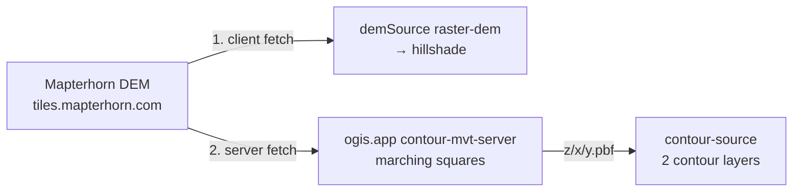

# Contours

> Contour lines are purely server-generated PBF vector tiles from the hosted ogis.app contour service — fully declarative in the style: the client only fetches and renders the tiles.

## Overview

Contours are the only fully server-side feature in the style. The build script adds a standard Mapbox Vector Tile source pointing at the hosted ogis.app contour service, plus two layers that style it. The client does nothing beyond normal vector tile rendering — MapLibre fetches and draws the PBF tiles like any other vector source.

- Gated by the `CONTOURS` toggle in [`scripts/build.mjs`](../scripts/build.mjs)
- No npm dependency or runtime registration — the vector source and layers are declared at build time

## Tile endpoint

- **Tile URL**: `https://tile.ogis.app/terrain/{z}/{x}/{y}.pbf` — constant `CONTOUR_PBF_TILE_URL`
- **Zoom range**: z9–14
- **Vector source**: `contour-source` (type `vector`)
- **Source-layer**: `contours`
- **Feature properties**: `ele` (elevation in metres) and `level` (0 = minor, 1 = major)

## Server side

Tiles are generated on demand by the hosted [contour-mvt-server](https://github.com/acalcutt/contour-mvt-server) at `tile.ogis.app`, which rasterises contours with marching squares over the **Mapterhorn DEM**:

- DEM endpoint: `https://tiles.mapterhorn.com/{z}/{x}/{y}.webp` — Terrarium-encoded WebP, standard Web Mercator XYZ
- DEM source: Copernicus GLO-30 global base + national/regional LiDAR layers on top
- Attribution required: `© Mapterhorn` (per their TileJSON attribution)

The **same** Mapterhorn endpoint is consumed in two places — client-side as the `demSource` raster-dem that feeds the hillshade layer, and server-side by the contour service — so one provider serves the whole terrain stack (see the caching note below).

## Server configuration

Replicating the ogis.app contour service with [contour-mvt-server](https://github.com/acalcutt/contour-mvt-server) comes down to a few gotchas: the source must point at Mapterhorn's Terrarium WebP tiles and its key must match the URL path the style requests (`terrain`); the config must emit source-layer `contours` with `ele`/`level` properties and per-zoom thresholds; and the blank-tile size must match Mapterhorn's own tile size — the server ships with a smaller blank-tile size that would render blank contour tiles at the wrong scale. See the project's own [documentation](https://github.com/acalcutt/contour-mvt-server) for the full configuration reference.

## Shared DEM / CDN caching

The same tile URL is therefore fetched twice — once by the client, once by the tile server — but the CDN serves the second request from cache, so the extra fetch is effectively free. This is why the client and server can share a single provider.

## Layers

Two layers are added. `contour-lines` is inserted at the water stack index (above landcover, below water); `contour-labels` is inserted below the POI stack at build time and then repositioned by `reorderContourLabelStack()` in `build()` to its final slot above the POI tiers — see [Label placement](#label-placement-in-the-symbol-stack) below.

| Layer            | Type   | Purpose                                                                                                                                                                              |
| ---------------- | ------ | ------------------------------------------------------------------------------------------------------------------------------------------------------------------------------------ |
| `contour-lines`  | line   | Minor and index contours in a single layer — a `case` expression on the elevation value switches style per line, hiding lines that fall off the 20 m minor cadence (`ele % 20 == 0`) |
| `contour-labels` | symbol | Line-placed elevation text, emitted only on index lines                                                                                                                              |

Both layers are styled from the central `COLOURS` object in [`scripts/build.mjs`](../scripts/build.mjs) — `COLOURS.CONTOURS` holds the minor/index/label colours — with the width and opacity ramps below. See [The Style Build](build.md) for how the colour object and per-feature config work.

### Line rendering — index vs minor hierarchy

The single `contour-lines` layer distinguishes index contours (every 100 m, `ele % 100 === 0`) from the minor lines between them with a `case` expression, then paints both through three-stop zoom ramps (z9 → z13 → z14) defined in `applyContours()` and the `CONTOUR_OPACITY_*` / `CONTOUR_WIDTH_*` constants. `CONTOUR_MID_ZOOM` (z13) is the middle stop and sets ramp position only — it no longer gates visibility, since minors are drawn at every zoom again:

| Zoom stop | Index opacity | Minor opacity | Index width | Minor width |
| --------- | ------------- | ------------- | ----------- | ----------- |
| z9        | 0.4           | 0.35          | 0.75 px     | 0.4 px      |
| z13       | 0.64          | 0.47          | 1.1 px      | 0.45 px     |
| z14       | 0.7           | 0.5           | 1.6 px      | 0.7 px      |

Minor lines are decimated to a 20 m elevation cadence via `CONTOUR_MINOR_EVERY` in [`scripts/build.mjs`](../scripts/build.mjs) — the paint `case` built by `contourCase()` (conditions `contourIndexCond` / `contourMinorCond`, with the full rationale commented inline in the script) draws a line only when `ele % 20 == 0` (the `case`'s hidden branch paints opacity 0 / width 0 otherwise). Index lines (`ele % 100 === 0`) are unaffected. The 20 m cadence divides the 100 m index interval exactly (100 / 20 = 5), so minors land symmetric at 20/40/60/80 m between every index pair — the previous 40 m cadence could not split 100 m evenly (100 / 40 = 2.5) and left a ragged 40-40-20 m pattern between index lines. The condition's offset 0 keeps drawn lines on the server's 20 m grid, so per zoom the effective drawn cadence is: all lines at z9 (server emits an 80 m interval), all minors at z10–12 (20 m), every 2nd at z13 (10 m), every 4th at z14 (5 m). The decimation exists because the server's densest intervals draw too many lines — thinning the minors keeps the hierarchy legible while dropping sub-pixel clutter. Both ramps use the original opacities (0.4→0.7 index, 0.35→0.5 minor); emphasis now comes from width and line count rather than transparency. Index lines remain clearly stronger than minors at every zoom — bolder (0.75→1.6 px vs 0.4→0.7 px) and only slightly more opaque; both width ramps use exponential interpolation (base 1.2).

### Label placement in the symbol stack

MapLibre resolves symbol collisions from the top of the stack down — the highest label layer places first and wins the space. `contour-labels` is therefore inserted low at build time (below the POI stack) and then repositioned by `reorderContourLabelStack()`, a post-pass called in `build()` after the outdoor-POI steps, to sit directly above the POI tiers (`outdoor-poi-z1`/`z2`, `outdoor-poi`, `outdoor-paths`) and below the peak tiers (`mountain-peak`, `mountain-peak-secondary`, `mountain-saddle`, `mountain-volcano`) and `park-label`. The collision order this produces:

- peaks and park labels win over contour labels;
- contour labels win over POI labels;
- town/place labels (above all of these) still win.

Without the repositioning the layer would sit at the bottom of the symbol stack and lose to every other label layer, so elevation text only appeared when the map overzoomed past the label-dense zooms.

### Label layout

`contour-labels` places text along the line (`symbol-placement: line`) with `text-padding: 4` and a `text-size` ramp of 11 px @ z12 → 13 px @ z14 — the tighter padding lets elevation text fit along more of each line. Labels stay metric at build time (see [Units](#units)).

## Zoom ceiling

> [!WARNING]
> **Do not raise the source maxzoom above z14** — contours stair-step visibly at z15+.

PBF contour tiles are generated by marching squares over the raster DEM's pixel grid, and geometry follows pixel boundaries. Beyond the supported zoom the underlying DEM grid becomes visible as stair-stepping. This is a fundamental limit of server-side contour generation from raster DEM data — hence the z9–14 source range.

## Units

Labels are always metric at build time — the label expression renders the rounded `ele` value with an `"m"` suffix. Imperial conversion is **not** part of the style: the dev compare app converts labels to feet at runtime via `applyImperialContours()` in [`dev/src/App.vue`](../dev/src/App.vue), gated by the app's `CONTOURS_TO_IMPERIAL` flag.

## Related

- [`scripts/build.mjs`](../scripts/build.mjs) — `CONTOURS` toggle, contour constants, and layers
- [The Style Build](build.md) — the central `COLOURS` object and per-feature config
- [`dev/src/App.vue`](../dev/src/App.vue) — `applyImperialContours()`
- [contour-mvt-server](https://github.com/acalcutt/contour-mvt-server) — the hosted tile server
- [Docs index](README.md)
