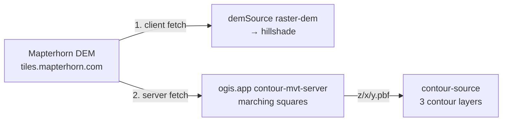

# Contours

> Contour lines are purely server-generated PBF vector tiles from the hosted ogis.app contour service — fully declarative in the style: the client only fetches and renders the tiles.

## Overview

Contours are the only fully server-side feature in the style. The build script adds a standard Mapbox Vector Tile source pointing at the hosted ogis.app contour service, plus two layers that style it. The client does nothing beyond normal vector tile rendering — MapLibre fetches and draws the PBF tiles like any other vector source.

- Gated by the `CONTOURS` boolean in [`scripts/build.mjs`](../scripts/build.mjs) (default `true`)
- No npm dependency or runtime registration — the vector source and layers are declared at build time

## Tile endpoint

- **Tile URL**: `https://tiles.ogis.app/terrain/{z}/{x}/{y}.pbf` — constant `CONTOUR_PBF_TILE_URL`
- **Zoom range**: z9–14 (`CONTOUR_PBF_SOURCE_MINZOOM = 9`, `CONTOUR_PBF_SOURCE_MAXZOOM = 14`)
- **Vector source**: `contour-source` (type `vector`)
- **Source-layer**: `contours`
- **Feature properties**: `ele` (elevation in metres) and `level` (0 = minor, 1 = major)

> [!NOTE]
> The tile server provides a `level` property (0/1), but the style layers ignore it — index lines are instead selected with `ele % 100 == 0` (100 m intervals). See [Layers](#layers). With the [recommended thresholds](#recommended-contour-mvt-server-configuration), z10–14 major intervals are exactly 100 m, so the server's major lines and the style's index selection agree.

## Server side

Tiles are generated on demand by the hosted [contour-mvt-server](https://github.com/acalcutt/contour-mvt-server) at `tiles.ogis.app`, which rasterises contours with marching squares over the **Mapterhorn DEM**:

- DEM endpoint: `https://tiles.mapterhorn.com/{z}/{x}/{y}.webp`
- Terrarium-encoded WebP, 512 px tiles, standard Web Mercator XYZ (confirmed by Mapterhorn's TileJSON at <https://tiles.mapterhorn.com/tilejson.json>)
- Serves up to z17, but only z0–12 are guaranteed globally; z13–17 exist only in covered z6-quadrant regions (some subpyramids stop at z14)
- DEM source: Copernicus GLO-30 (30 m) global base + ~90 national/regional LiDAR layers on top
- Attribution required: `© Mapterhorn` (per their TileJSON attribution)

## Recommended contour-mvt-server configuration

To replicate the ogis.app contour service against the Mapterhorn DEM, [contour-mvt-server](https://github.com/acalcutt/contour-mvt-server) should be configured with:

```json
{
  "server": {
    "port": 11001
  },
  "blankTileNoDataValue": 0,
  "blankTileSize": 512,
  "blankTileFormat": "webp",
  "sources": {
    "terrain": {
      "tiles": "https://tiles.mapterhorn.com/{z}/{x}/{y}.webp",
      "encoding": "terrarium",
      "maxzoom": 17,
      "cacheSize": 100,
      "timeoutMs": 10000,
      "contours": {
        "multiplier": 1,
        "thresholds": {
          "1": [600, 3000],
          "4": [300, 1500],
          "8": [150, 750],
          "9": [80, 400],
          "10": [20, 100],
          "11": [20, 100],
          "12": [20, 100],
          "13": [10, 50],
          "14": [5, 25]
        },
        "contourLayer": "contours",
        "elevationKey": "ele",
        "levelKey": "level",
        "extent": 4096,
        "buffer": 1
      }
    }
  }
}
```

- **Purpose** — contour-mvt-server (Express + maplibre-contour, Node ≥ 18, `npx contour-mvt-server config.json` or the npm CLI) generates gzipped MVT v2 contour tiles on demand from raster DEM sources. The style consumes it as a plain vector source — nothing client-side.
- **Endpoint** — the source key `terrain` appears in the URL path, so the source serves `GET /terrain/{z}/{x}/{y}.pbf`, matching `CONTOUR_PBF_TILE_URL`. If the key were renamed, the style URL would change too.
- **Source-layer & properties** — the server emits source-layer `contours` with properties `ele` (elevation in metres, key `elevationKey`) and `level` (0 = minor, 1 = major, key `levelKey`) — exactly what the style's two layers read.
- **`tiles` + `encoding`** — Mapterhorn's own TileJSON confirms `encoding: "terrarium"` and 512 px WebP tiles, so the URL and encoding above are the only correct pairing.
- **`maxzoom: 17`** — the service's maximum. Contour requests arrive at the DEM zoom (overzoom 0), and requests above the DEM maxzoom silently use the max-zoom tile. Since the style only requests z9–14, this provides full headroom.
- **`blankTileSize: 512`** (important gotcha) — missing DEM tiles produce a blank tile at this size. The default is 256, which mismatches Mapterhorn's 512 px tiles and would render blank contour tiles at the wrong scale. `blankTileFormat: "webp"` matches the source format.
- **Thresholds** (`[minor, major]` metres per zoom, highest key ≤ zoom applies) — z10–14 repeat the project's proven tuning: 20/100 m at z10–12 keeps major contours at exactly 100 m so the style's `ele % 100 == 0` index selection lines up with the server's major lines; 10/50 m at z13 and 5/25 m at z14 add density as the user zooms in. The z1/4/8/9 keys follow the server defaults so low-zoom behaviour is explicit. Keys above z14 are unnecessary because the style's source maxzoom is 14 (see [Zoom ceiling](#zoom-ceiling)).
- **`multiplier: 1`** — keeps `ele` in metres; imperial conversion happens client-side in `applyImperialContours()` (see [Units](#units)). `extent` and `buffer` are the server defaults.
- **Operational notes** — the server sends no cache headers itself (cache-control is commented out in its source), so at ogis.app an nginx/CDN in front provides the caching. CORS is open (all origins), so direct browser access works. Port 11001 matches the ogis.app deployment.

## Shared DEM / CDN caching

Mapterhorn is the adopted terrain tile provider for the project. The **same** Mapterhorn endpoint is consumed in two places:

1. **Client-side** — as `DEM_SOURCE_URL`, the `demSource` raster-dem source that feeds the hillshade layer.
2. **Server-side** — by the ogis.app contour service, which fetches Mapterhorn tiles and generates contour PBF tiles from them.



The same tile URL is therefore fetched twice — once by the client, once by the tile server — but the CDN serves the second request from cache, so the extra fetch is effectively free. This is why the client and server can share a single provider.

> [!NOTE]
> Both consumers hit the same `tiles.mapterhorn.com` tile; the CDN answers the contour service's request from cache rather than re-hitting the origin.

## Layers

Two layers are inserted at the water stack index (above landcover, below water):

| Layer | Type | Purpose |
| --- | --- | --- |
| `contour-lines` | line | Minor and index contours in a single layer — a `case` expression on `ele % 100` switches colour, opacity and width (index at 100 m intervals) |
| `contour-labels` | symbol | Line-placed elevation text, emitted only on index lines via a conditional text-field |

Styling constants (all in [`scripts/build.mjs`](../scripts/build.mjs)):

- `CONTOUR_WIDTH_MINOR` / `CONTOUR_WIDTH_INDEX` — line widths (interpolated z12 → z14)
- `CONTOUR_OPACITY_MINOR` / `CONTOUR_OPACITY_INDEX` — opacities (interpolated z12 → z14)
- `CONTOUR_LAYER_MAXZOOM` — layer visibility ceiling (20)
- `CONTOUR_LABEL_EXPR` — the metric label expression
- `COLOURS.CONTOURS` — `MINOR` sand-brown `rgb(198, 170, 138)`, `INDEX` topo-brown `rgb(164, 130, 94)`, `LABEL` dark umber `#5c4634`, `HALO` semi-transparent white

## Zoom ceiling

> [!WARNING]
> **Do not raise the source maxzoom above z14** — contours stair-step visibly at z15+.

PBF contour tiles are generated by marching squares over a 512×512-pixel DEM grid; geometry follows pixel boundaries. At z14 the ~1.2 km² tiles are small enough that contours look smooth; at z15 the same 512 pixels cover ~0.6 km² and the underlying DEM grid becomes visible as stair-stepping. This is a fundamental limit of server-side contour generation from raster DEM data — hence the z9–14 source range.

## Units

Labels are always metric at build time — `CONTOUR_LABEL_EXPR` renders the rounded `ele` value with an `"m"` suffix. Imperial conversion is **not** part of the style: the dev compare app converts labels to feet at runtime via `applyImperialContours()` in [`dev/src/App.vue`](../dev/src/App.vue), which replaces the `contour-labels` `text-field` with `ele × 3.28084` plus an `"ft"` suffix.

## Related

- [`scripts/build.mjs`](../scripts/build.mjs) — `CONTOURS` toggle, contour constants, and layers
- [`dev/src/App.vue`](../dev/src/App.vue) — `applyImperialContours()`
- [contour-mvt-server](https://github.com/acalcutt/contour-mvt-server) — the hosted tile server
- [Docs index](README.md)
