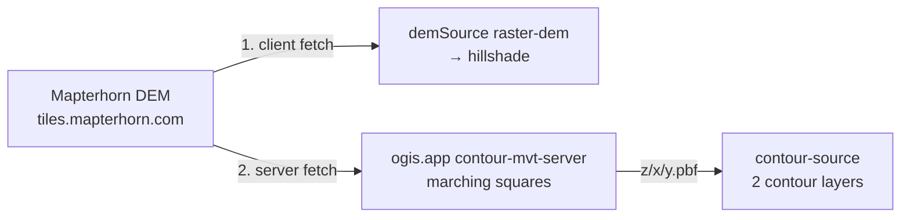

# Contours

> Contour lines are purely server-generated PBF vector tiles from the hosted ogis.app contour service — fully declarative in the style: the client only fetches and renders the tiles.

## Overview

Contours are the only fully server-side feature in the style. The build script adds a standard Mapbox Vector Tile source pointing at the hosted ogis.app contour service, plus two layers that style it. The client does nothing beyond normal vector tile rendering — MapLibre fetches and draws the PBF tiles like any other vector source.

- Gated by the `CONTOURS` toggle in [`scripts/build.mjs`](../scripts/build.mjs)
- No npm dependency or runtime registration — the vector source and layers are declared at build time

## Tile endpoint

- **Tile URL**: `https://tile.ogis.app/terrain/{z}/{x}/{y}.pbf` — constant `CONTOUR_PBF_TILE_URL`
- **Zoom range**: z9–14
- **Vector source**: `contour-source` (type `vector`)
- **Source-layer**: `contours`
- **Feature properties**: `ele` (elevation in metres) and `level` (0 = minor, 1 = major)

## Server side

Tiles are generated on demand by the hosted [contour-mvt-server](https://github.com/acalcutt/contour-mvt-server) at `tile.ogis.app`, which rasterises contours with marching squares over the **Mapterhorn DEM**:

- DEM endpoint: `https://tiles.mapterhorn.com/{z}/{x}/{y}.webp` — Terrarium-encoded WebP, standard Web Mercator XYZ
- DEM source: Copernicus GLO-30 global base + national/regional LiDAR layers on top
- Attribution required: `© Mapterhorn` (per their TileJSON attribution)

The **same** Mapterhorn endpoint is consumed in two places — client-side as the `demSource` raster-dem that feeds the hillshade layer, and server-side by the contour service — so one provider serves the whole terrain stack (see the caching note below).

## Server configuration

Replicating the ogis.app contour service with [contour-mvt-server](https://github.com/acalcutt/contour-mvt-server) comes down to a few gotchas: the source must point at Mapterhorn's Terrarium WebP tiles and its key must match the URL path the style requests (`terrain`); the config must emit source-layer `contours` with `ele`/`level` properties and per-zoom thresholds; and the blank-tile size must match Mapterhorn's own tile size — the server ships with a smaller blank-tile size that would render blank contour tiles at the wrong scale. See the project's own [documentation](https://github.com/acalcutt/contour-mvt-server) for the full configuration reference.

## Shared DEM / CDN caching

The same tile URL is therefore fetched twice — once by the client, once by the tile server — but the CDN serves the second request from cache, so the extra fetch is effectively free. This is why the client and server can share a single provider.

## Layers

Two layers are inserted at the water stack index (above landcover, below water):

| Layer            | Type   | Purpose                                                                                                        |
| ---------------- | ------ | -------------------------------------------------------------------------------------------------------------- |
| `contour-lines`  | line   | Minor and index contours in a single layer — a `case` expression on the elevation value switches style per line |
| `contour-labels` | symbol | Line-placed elevation text, emitted only on index lines                                                        |

Both layers are styled from the central `COLOURS` object in [`scripts/build.mjs`](../scripts/build.mjs) — `COLOURS.CONTOURS` holds the minor/index/label colours — with width and opacity zoom ramps defined alongside the layer constants. See [The Style Build](build.md) for how the colour object and per-feature config work.

## Zoom ceiling

> [!WARNING]
> **Do not raise the source maxzoom above z14** — contours stair-step visibly at z15+.

PBF contour tiles are generated by marching squares over the raster DEM's pixel grid, and geometry follows pixel boundaries. Beyond the supported zoom the underlying DEM grid becomes visible as stair-stepping. This is a fundamental limit of server-side contour generation from raster DEM data — hence the z9–14 source range.

## Units

Labels are always metric at build time — the label expression renders the rounded `ele` value with an `"m"` suffix. Imperial conversion is **not** part of the style: the dev compare app converts labels to feet at runtime via `applyImperialContours()` in [`dev/src/App.vue`](../dev/src/App.vue), gated by the app's `CONTOURS_TO_IMPERIAL` flag.

## Related

- [`scripts/build.mjs`](../scripts/build.mjs) — `CONTOURS` toggle, contour constants, and layers
- [The Style Build](build.md) — the central `COLOURS` object and per-feature config
- [`dev/src/App.vue`](../dev/src/App.vue) — `applyImperialContours()`
- [contour-mvt-server](https://github.com/acalcutt/contour-mvt-server) — the hosted tile server
- [Docs index](README.md)
