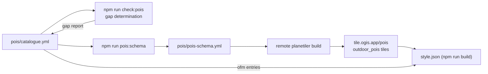

# How POIs Work

> The conceptual map of the outdoors style's point-of-interest system: where a POI comes from, how it earns an icon, and what this repo actually controls.

## 1. The layered model — where a POI comes from

Four layers, each a translation of the last:

- **OpenStreetMap** — raw tags on nodes/ways: `tourism=alpine_hut`, `amenity=drinking_water`, `leisure=park`, `historic=castle`. The universe of possible POIs.
- **OpenMapTiles schema (OMT)** — the translation layer. `poi_class()` (see [`.cache/openmaptiles-poi-class.sql`](../.cache/openmaptiles-poi-class.sql)) maps **344 tag combinations → 167 classes** (e.g. `amenity=pub`/`biergarten` → class `beer`; `leisure=park` → `park`). Tag values with no explicit mapping fall through to the class (`ELSE subclass`).
- **Vector tiles** — the data. Every POI feature carries `class`, `subclass`, `name` and `rank`. Critically: **OMT poi data only exists from z14** — below that the poi layer carries only stations/ferry terminals ([`poi.sql`](../.cache/openmaptiles-poi-poi.sql)).
- **The style** — decides what renders, at what zoom, with which icon. Liberty's style (our base) and our outdoor style are two different answers here. **This is the layer this repo works on.**

> [!WARNING]
> **The z14 data floor.** OMT poi features simply do not exist below z14 (only railway stations/halts and ferry terminals do). Any POI that renders below z14 must get its data from elsewhere — in this style, from the custom extract (sections 6–8).

## 2. Where a POI's "definition" actually lives

Not in the style JSON — the style only adds rendering rules. A POI is defined by three collaborating places:

1. The **OMT schema** — the tag combination → class mapping.
2. The **Maki sprite** — the icon glyphs, looked up by name (264 icons).
3. The **tile data** — class / rank / name per feature.

So adding a POI to this style is never "add an icon to a style file". It's: declare the class in the catalogue (and optionally the tag map for the custom extract), make sure the Maki name exists, and the data flows from the right source.

## 3. Maki icons: a naming convention, not a contract

Liberty's icon lookup is fully data-driven — the icon name **is** the class name (`["get","class"]` with no fallback). Classes without a Maki glyph silently render icon-less (e.g. `atm`, `office`; Liberty's `rail` class was dead because the sprite has `railway`, not `rail`).

Our catalogue deliberately decouples class/kind → icon with an explicit `"marker"` fallback (e.g. `atm` → `bank`, `hut` → `lodging`, `viewpoint` → `star_stroked`, `water` → `drinking_water`). The checker's sprite validation ([5] in [`scripts/check-poi-coverage.mjs`](../scripts/check-poi-coverage.mjs)) enforces every icon name exists in the sprite.

> [!NOTE]
> **Maki is a naming convention, not a contract.** There is no promise that a class has a matching glyph. Liberty assumes it (and silently draws nothing when wrong); our catalogue maps explicitly and the checker fails the build on any missing glyph.

## 4. What Liberty does with POIs (the base we extend)

Four symbol layers ([`.cache/liberty.json`](../.cache/liberty.json), indexes 91–94): `poi_r1`/`poi_r7`/`poi_r20` — rank-tiered, all 167 classes, data-driven icons, appearing at z15/16/17 — plus `poi_transit` (airport/bus/rail, from z0).

**Rank** = per-grid-cell cross-class importance: `row_number()` over 100px grid cells, ordered by class importance (hospital 20, railway 40, bus 50, park 120, shop 400, grocery 500, fast_food 600, bar 800, default 1000 — lower = more important). Liberty shows the top-6 POIs per cell at z15, ranks 7–19 at z16, everything at z17.

"Urban-biased" in practice: the importance order is built around city amenities (hospitals, transit, shops, bars), and even the top tier only appears at z15 — a sparse rural cell shows whatever few POIs it has at z15, while dense city cells progressively add more POIs as you zoom to z16/z17.

Inverting the original confusion: **Liberty doesn't under-use the OMT schema — it renders all 167 classes, but late, urban-biased, and ranked by class importance.**

## 5. What we keep from Liberty vs what we replace

- **Keep** — the openmaptiles tile source, the Maki sprite, the OMT schema mapping, and 46 of the 111 base layers (all labels, roads, land, plus `poi_transit` re-filtered to railway + airport only).
- **Replace** — the three rank-tier layers and their rendering rules, with the catalogue-driven `outdoor-poi-z1`/`z2`.

`poi_transit` survives but trimmed: the bus class is dropped (tier-2 already covers bus stops from z14), leaving railway stations and airports visible from z0.

None of the outdoor style's POI symbol layers originate from Liberty — they're all built here from the catalogue ([`scripts/build.mjs`](../scripts/build.mjs), POI section lines 2070–2557).

## 6. The catalogue: one file, two sources

[`pois/catalogue.yml`](../pois/catalogue.yml) declares every POI the style cares about (44 entries), in two kinds:

- **`source: ofm`** (26 entries) — a class allowlist: "render OMT class X at this tier". Tier-1 (8 classes, priority) → `outdoor-poi-z1`; tier-2 (18 classes, amenities) → `outdoor-poi-z2`. Optional `rank_max` caps density: park ≤ 6, bus ≤ 30, post ≤ 30 (post boxes/bus stops outrank shops in the OMT rank, so uncapped they'd flood city cells).
- **`source: custom`** (18 entries) — an OSM tag selector (`include_when`) for the hosted extract tiles (`tile.ogis.app/pois`, source-layer `outdoor_pois`) → rendered by the `outdoor-poi` layer. These are the POIs OMT can't serve — either below z14 or classes it can't emit.

## 7. What "promotion" actually means

Two changes when a Liberty POI becomes ours:

1. **Zoom** — Liberty's z15/16/17 tiers become z14 for both tiers (tier-1 nominally declares z12; the OMT data floor makes it z14 in practice, and the custom extract covers the z12–13 window).
2. **The bigger change** — **rank-based progressive disclosure replaced by class allowlists**: every allowlisted class renders at the tier zoom regardless of importance, with only the flood-prone classes (park, bus, post) carrying density caps.

Predictability over per-cell ranking: the same class renders the same way in every cell — a park icon at the tier zoom is a park icon, not a rank-12 casualty of its neighbours.

## 8. The custom extract's real role (not just a "z12–13 gap filler")

8 of the 18 custom kinds render **only** from the extract at every zoom: hut, viewpoint, pass, ranger_station, playground, skiing, bicycle, trailhead — and 4 of those (pass, ranger_station, skiing, trailhead) are classes OMT's poi layer cannot emit at all.

The other 10 kinds dual-source: the extract provides their below-z14 window, and at z14+ they render from both sources with identical icons/labels (harmless redundancy). They are park, castle, water (drinking_water), shelter, parking, picnic_site, information, toilets, campsite and ferry — each declared twice in the catalogue, once per source. Per-kind `min_zoom` gates when a kind appears within the extract's z12–16 range (values below 12 are effectively floored at 12).

## 9. The pipeline

Each step, and where it runs:

1. **Catalogue** — declare every POI (local source of truth, hand-maintained).
2. **`npm run check:pois`** — gap determination: dead ofm classes, zero-coverage classes, sprite-missing icons, rank caps; feeds the gap report back to the catalogue. Runs locally ([`scripts/check-poi-coverage.mjs`](../scripts/check-poi-coverage.mjs)).
3. **`npm run pois:schema`** — generates `pois/pois-schema.yml` from the custom entries. Runs locally ([`scripts/generate-poi-schema.mjs`](../scripts/generate-poi-schema.mjs)).
4. **Remote planetiler build** — the generated schema is the drop-in input; runs remote/outside this repo (see [features.md](features.md)).
5. **Hosted tiles** — `tile.ogis.app/pois`, source-layer `outdoor_pois`, z12–16.
6. **`npm run build`** — reads the catalogue's ofm allowlists and wires the extract's `outdoor_pois` layer into `style.json` ([`scripts/build.mjs`](../scripts/build.mjs), POI section lines 2070–2557).

## 10. Where to go deeper

- [docs/README.md](README.md) — documentation index
- [docs/pois.md](pois.md) — implementation reference (catalogue format, checker sections, gap report)
- [docs/5.style-structure.md](5.style-structure.md) §16–21 — layer-by-layer style details
- [docs/features.md](features.md) — tile generation (planetiler YAML vs Java profile)
- [`pois/catalogue.yml`](../pois/catalogue.yml) · [`pois/pois-schema.yml`](../pois/pois-schema.yml) · [`scripts/check-poi-coverage.mjs`](../scripts/check-poi-coverage.mjs) · [`scripts/generate-poi-schema.mjs`](../scripts/generate-poi-schema.mjs)
