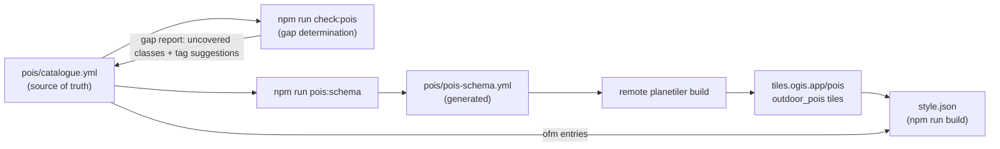

# Outdoor POIs (catalogue-driven)

> The single source of truth for the outdoors style's POI implementation: which POIs render, where the data comes from, at what zoom, and with which icon — all declared in `pois/catalogue.yml`.

## Overview — two data sources

Outdoor POIs render from two sources, and the split is deliberate:

- **OpenFreeMap (OFM) tiles** — the OpenMapTiles `poi` source-layer that ships with the Liberty base style (z14+). Free, planet-wide and always current, so it is the default home for a POI.
- **Hosted custom extracts** — Planetiler-built tiles at `tiles.ogis.app/pois/{z}/{x}/{y}.pbf` (source-layer `outdoor_pois`, z12–16), generated from an OSM extract. They fill the zooms and classes OFM cannot serve.

Joe's design rule: **extract as much as possible from the OFM tiles (z14+), then fill the gaps with custom extracts (z12–13).** The catalogue is the declaration of that split — every POI is either `source: ofm` (rendered from OpenMapTiles data) or `source: custom` (rendered from the hosted extract).

> [!NOTE]
> OpenMapTiles `poi` features only exist from z14. Any catalogue entry that wants to render below z14 (tier-1 ambition) depends on a custom extract — the checker's gap report tracks exactly that.

## Workflow

The POI pipeline runs left to right; the only step that runs in this repo is the last one (`npm run build`):



1. **`pois/catalogue.yml`** — declare every POI the style wants.
2. **`npm run check:pois`** — gap determination against the live OpenMapTiles `poi` schema, the built style, and the sprite sheet. The gap report ([section 6](#reading-the-gap-report)) lists ofm entries that cannot render below z14 and suggests the OSM tag for a custom entry that would cover them.
3. **`npm run pois:schema`** — regenerate `pois/pois-schema.yml` from the catalogue's custom entries.
4. **Remote planetiler build** — the generated schema is the drop-in input for the build that produces the hosted `tiles.ogis.app/pois` extracts (default area `geofabrik:italy`).
5. **`npm run build`** — `build.mjs` reads the catalogue and builds `style.json`: the tier layers and every icon map derive from it.

## Catalogue format

[`pois/catalogue.yml`](../pois/catalogue.yml) — 43 entries, each with:

| Field          | Sources | Description                                                            |
| -------------- | ------- | ---------------------------------------------------------------------- |
| `id`           | both    | unique entry identifier                                                 |
| `source`       | both    | `ofm` (OpenMapTiles `poi` source-layer) or `custom` (hosted `outdoor_pois` tiles) |
| `class`        | ofm     | OMT `poi` class the entry renders (must exist in the OMT class universe) |
| `tier`         | ofm     | `1` (priority classes) or `2` (amenities)                               |
| `rank_max`     | ofm     | optional density cap on the OMT `rank` (park: `6`)                      |
| `icon`         | both    | Maki sprite icon name                                                   |
| `show_title`   | both    | whether the name label renders                                          |
| `include_when` | custom  | OSM tag map that selects the feature                                    |
| `kind`         | custom  | output `kind` attribute for the `outdoor_pois` layer                    |
| `min_zoom`     | custom  | feature-level zoom in the generated schema                              |

Tier semantics:

- **tier 1** — priority classes (incl. park) render icon + name from z12. Data reality: OMT `poi` data starts at z14, so they effectively render from z14.
- **tier 2** — amenities render icon + name from z14.

Example — the park is declared twice, once per source:

```yaml
# ofm: rendered from the OpenMapTiles poi layer (class park). rank_max caps
# the OMT rank at 6 so pocket parks don't flood the z12 layer.
- id: park
  source: ofm
  class: park
  tier: 1
  rank_max: 6
  icon: park
  show_title: true

# custom: rendered from the hosted extract, covering the z12–13 window
# OMT data does not provide.
- id: park_custom
  source: custom
  include_when:
    leisure: park
  kind: park
  min_zoom: 12
  icon: park
  show_title: true
```

## How build.mjs consumes the catalogue

The POI section of [`scripts/build.mjs`](../scripts/build.mjs) (lines 1964–2446) is one contiguous block: catalogue load → derived class/icon lists → constants → helpers → apply functions. The catalogue is parsed at build start; a missing or malformed `pois` array fails the build loudly.

Layers render bottom → top in catalogue order:

```
peaks → park-label → custom outdoor-poi → tier 1 (z1) → tier 2 (z2) → poi_transit
```

- `tier: 1` → `outdoor-poi-z1` (minzoom 12); `tier: 2` → `outdoor-poi-z2` (minzoom 14). The class allowlists are the catalogue's tier classes.
- Icon maps are generated by `poiIconMatch()` — a `match` expression over `class`/`kind` → sprite icon with the `"marker"` fallback (`POI_ICON_DEFAULT`). `poiTextField()` emits the name when every entry in a group has `show_title: true` (mixed groups get a per-entry `case`). `rankCapCondition()` appends the park `rank <= 6` cap to the z1 filter.
- Peaks and park-label are **not** catalogue-driven — they are kept byte-identical to their previous behaviour (see [§16 / §17](5.style-structure.md#16-peak_labels)).

## The schema generator

[`scripts/generate-poi-schema.mjs`](../scripts/generate-poi-schema.mjs) (`npm run pois:schema`) writes [`pois/pois-schema.yml`](../pois/pois-schema.yml) from the catalogue's custom entries — one planetiler feature per entry, in catalogue order:

- Layer `outdoor_pois`, geometry `point`, with `include_when` and `min_zoom` copied from the entry.
- Attributes: `kind` (the entry's kind) and `name` (from the OSM `name` tag); kinds `hut`, `shelter`, `viewpoint`, `pass` also carry `ele` (from the `ele` tag).
- Source: `osm` with the extract area — default `geofabrik:italy`, overridden with `--area=geofabrik:world` or the `POI_AREA` env var.
- The output file is marked GENERATED — change the catalogue, not the schema.

## The coverage checker

[`scripts/check-poi-coverage.mjs`](../scripts/check-poi-coverage.mjs) (`npm run check:pois`) cross-checks the catalogue against three upstreams: the live OpenMapTiles `poi` schema, the built `style.json`, and the sprite sheet. Sections (the script has no [7]):

| Section | What it reports |
| ------- | --------------- |
| [1] Upstream schema | ETag-cached `mapping.yaml` / `poi.sql` / `class.sql` / `poi.yaml` from openmaptiles master; subclass universe; class universe (167 values) and how the class is computed |
| [2] Dead ofm entries | catalogue classes OMT can never emit or remaps elsewhere (e.g. `pub` → `beer`, `ferry` → `ferry_terminal`) — these render nothing and must be fixed |
| [3] OMT-equivalent custom entries | custom kinds whose OSM tags OMT already ingests — candidates for promotion to ofm instead of the hosted extract |
| [4] Style coverage | ofm classes with no style layer filter (zero coverage = regression bug) |
| [5] Sprite icon validation | fetches the style's sprite JSON and validates every icon-image literal — missing icons exit 1 |
| [6] Gap report | advisory: ofm entries whose desired zoom is below the OMT data floor (z14) — see below |
| [8] Custom kind style coverage | custom kinds missing from the `outdoor-poi` icon-image match |
| [9] Dead icon mappings | kinds in the icon-image match with no catalogue entry |
| [10] Summary | totals + exit code |

Exit code is 0 only when fully green: no dead ofm entries, no zero-coverage classes, no sprite-missing icons.

### Reading the gap report ([6])

Desired data zoom: tier 1 → **z12**, plain tier 2 → z14 (no gap). Every ofm entry wanting z12 sits below the OMT `poi` data floor (z14), so it renders nothing at z12–13 unless a custom extract covers it. The report lists each entry's custom-coverage status and, when uncovered, an OSM-tag suggestion (`suggestOsmTag` — e.g. `leisure: park`).

Currently 8 entries want z12 data and **1 is uncovered** (castle) — with a tag suggestion. This list is the roadmap for custom extracts: add an entry to the catalogue, regenerate the schema, rebuild the hosted tiles.

## Known data realities

- **OMT `poi` data starts at z14.** Tier-1's z12 ambition renders from z14 in practice — still one zoom better than Liberty, which showed its park top tier at z15.
- **`atm` uses the `bank` icon** — the Maki sprite has no `atm` glyph; the sprite validation would fail on any icon name absent from the sheet.
- **Custom extracts are area-limited** (default `geofabrik:italy`). Outside that area only the OFM path provides POIs.

## Related

- [Docs index](README.md)
- [Style structure — §18 / §21](5.style-structure.md)
- [Outdoor feature tiles (POIs & routes)](features.md) — layer overview and tile endpoints
- [`pois/catalogue.yml`](../pois/catalogue.yml) · [`pois/pois-schema.yml`](../pois/pois-schema.yml)
- [`scripts/check-poi-coverage.mjs`](../scripts/check-poi-coverage.mjs) · [`scripts/generate-poi-schema.mjs`](../scripts/generate-poi-schema.mjs)
